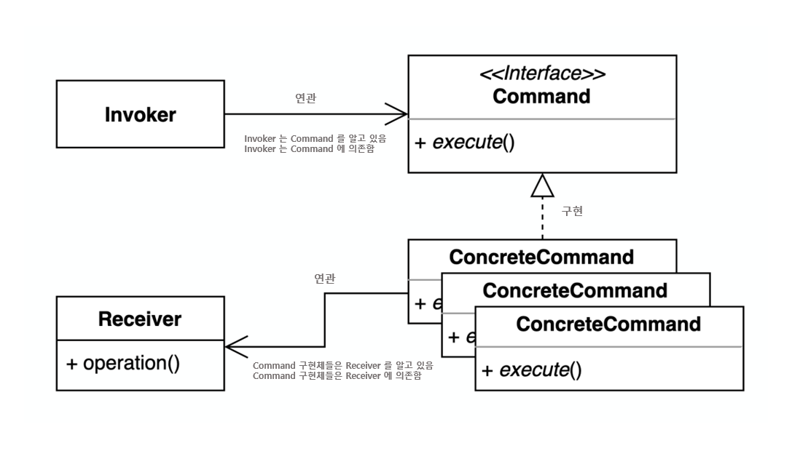

# Command 패턴

## 개요

### 해결하고자 하는 문제

- 요청과 실행의 분리 :  
  ***명령을 요청하는 객체와 명령을 실행하는 객체를 분리하여, 호출-실행 간의 의존성을 낮춤***
- 명령 객체의 재사용 :  
  명령 객체를 재사용하여 새로운 명령을 쉽게 만들 수 있음
- 실행 취소(undo), 재실행(redo), 지연실행(lazy) 등의 지원 :  
  명령 객체에 실행 취소, 재실행 등과 같은 기능을 추가하여, 실행의 유연성을 높임
- 로깅, 트랜잭션 지원 추가 :  
  명령 객체에 로깅, 트랜잭션 등을 쉽게 추가할 수 있음


### 문제해결 아이디어



- 요청 자체를 캡슐화하여 호출자(invoker)와 수신자(receiver)를 분리
  - Command : 연산 수행에 필요한 인터페이스를 선언
  - ConcreteCommand : Receiver 객체와 실제 처리내용 간의 연결을 정의
  - Receiver : ConcreteCommand 를 통해 실제 처리내용을 수행
  - Invoker : 전달받은 ConcreteCommand 를 실행
  - Client : Invoker 에게 ConcreteCommand 를 전달
- 커맨드 구현체들의 execute() 를 통해 리시버의 실제 처리가 동작하는 방식
- 리시버의 처리가 바뀌더라도, 호출자의 코드는 변경되지 않음
- Command 인터페이스에 unexecute() 를 추가하여 실행취소를 구현할 수도 있음


### 구현방법

- 커맨드 인터페이스 정의
- 호출자(invoker), 수신자(receiver) 클래스 식별
- 호출자에서 수신자의 비즈니스 로직을 직접 실행하는 부분을 커맨드 구현체를 실행하는 것으로 교체
  - 수신자를 호출하는 커맨드 구현체 작성
  - 호출자 내 수신자 호출 코드를 커맨드 구현체 호출로 대체


### ASIS-TOBE 예제코드

```typescript
/* 수신자(receiver) */
class Light {
  public turnOn() { console.log("Light is on"); }
  public turnOff() { console.log("Light is off"); }
}

/* 호출자(invoker) */
class LightSwitch {
  public isOn: boolean = false;

  constructor(private readonly light: Light) {}

  public toggle() {
    if (this.light.isOn) {
      this.light.turnOff();     // 호출자가 수신자를 직접 접근
      this.isOn = false;        // (=호출자가 수신자를 알고있는 구조)
    } else {
      this.light.turnOn();
      this.isOn = true;
    }
  }
}
```
- 호출자가 수신자를 직접 호출하는(=알고있는) 구조  
-  수신자의 변경에 함께 영향받는 구조   
  ex1) 수신지의 구현이 변경될때  
  ex2) 수신자의 인터페이스가 변경될때  
  ex3) 수신자에 새로운 기능이 추가될때  


```typescript
/* 수신자(receiver) */
class Light {
  public turnOn() { console.log("Light is on"); }
  public turnOff() { console.log("Light is off"); }
}

/* 요청(Command) */
interface Command {
    execute();
}

class TurnOnCommand implements Command {
  constructor(private readonly light: Light) {}

  public execute() {
    this.light.turnOn(); // 커맨드 구현체가 수신자에 접근
  }
}

class TurnOffCommand implements Command {
  constructor(private readonly light: Light) {}

  public execute() {
    this.light.turnOff(); // 커맨드 구현체가 수신자에 접근
  }
}

/* 호출자(invoker) */
class LightSwitch {
  public isOn: boolean = false;

  constructor(
    private readonly turnOnCommand: TurnOnCommand,
    private readonly turnOffCommand: TurnOffCommand,
  ) {}

  public toggle() {
    if (this.isOn) {
      this.turnOffCommand.execute();  // 호출자는 수신자를 알지못함
      this.isOn = false;              // 수신자의 구현이 변경되더라도 호출자의 코드는 영향받지 않음 (=커맨드 구현체에서 대응)
    } else {
      this.turnOnCommand.execute();
      this.isOn = true;
    }
  }
}
```
- 호출자는 수신자를 알지못함
- 수신자에 접근하는건 커맨드 구현체
- 호출자는 각 커맨드 구현체들의 execute를 통해서 수신자를 호출함
- 호출자는 수신자의 변경에 영향받지 않음 (=커맨드 구현체만 영향받음)


---
## 사용사례

### Java

```java
public class App {
  public void main() {
    Runnable runnable = new Runnable() {
      @Override
      public void run() {
        // do somthing
      }
    };

    Thread t1 = new Thread(runnable);
    t1.start();

    Thread t2 = new Thread(runnable);
    t2.start();
  } 
}
```
- java의 Runnable 은 Command 패턴의 아이디어와 매우 유사한 개념임
- Runnable 내부에 처리를 정의하고, Runnable 을 받아주는 수신자에게 전달하면, 수신자 쪽에서 Runnable.run 을 호출  
  (위 예제에서는 Runnable 이 커맨드, Runnable 내부 Override된 run 메소드가 수신자, Thread 가 호출자)


### Spring Framework

```java
public class App {
  private DataSource dataSource;

  // ...

  public void main() {
    SimpleJdbcInsert jdbcInsert = new SimpleJdbcInsert(dataSource)
      .withTableName("user")
      .usingGeneratedKeyColumns("id");
    
    Map<String, Object> data = new HashMap<>();
    data.put("name", "foo");
    data.put("age", 30);
    data.put("contact", "010-0000-0000");
    
    jdbcInsert.execute(data);
  }
}
```
- Insert SQL을 생성하는 행위 자체를 커맨드로 정의함
- 데이터소스, 테이블 지정, 컬럼 지정, 값 지정 한다음 execute 하면, Insert SQL 가 생성→검증→실행 되는 방식
  (위 예제에서는 SimpleJdbcInsertOperations 가 커맨드인터페이스, SimpleJdbcInsert가 커맨드 구현체, AbstractJdbcInsert가 수신자)
- 참고자료
  - https://github.com/spring-projects/spring-framework/blob/main/spring-jdbc/src/main/java/org/springframework/jdbc/core/simple/SimpleJdbcInsert.java
  - https://github.com/spring-projects/spring-framework/blob/main/spring-jdbc/src/main/java/org/springframework/jdbc/core/simple/SimpleJdbcInsertOperations.java
  - https://github.com/spring-projects/spring-framework/blob/main/spring-jdbc/src/main/java/org/springframework/jdbc/core/simple/AbstractJdbcInsert.java


### Nestjs

```typescript
export class CreateOrderCommand {
  constructor(public readonly customerName: string) {}
}
```
- 주문생성 커맨드 정의

```typescript
import { CommandHandler, ICommandHandler } from '@nestjs/cqrs';
import { CreateOrderCommand } from './create-order.command';

@CommandHandler(CreateOrderCommand)
export class CreateOrderHandler implements ICommandHandler<CreateOrderCommand> {
  execute(command: CreateOrderCommand) {
    console.log(`Creating order for customer: ${command.customerName}`);
  }
}
```
- 주문생성 커맨드의 상세 처리를 수행하는 수신자 정의
- 정의한 수신자를 커맨드핸들러에 등록

```typescript
import { Module } from '@nestjs/common';
import { CommandBus, CqrsModule } from '@nestjs/cqrs';
import { CreateOrderHandler } from './create-order.handler';
import { CreateOrderCommand } from './create-order.command';

@Module({
  imports: [CqrsModule],
  providers: [CreateOrderHandler],
})
export class AppModule {
  constructor(private readonly commandBus: CommandBus) {}

  onModuleInit() {
    this.commandBus.execute(new CreateOrderCommand('John Doe'));
  }
}
```
- commandBus를 통해 주문생성 커맨드 요청
- 등록되어있는 커맨드핸들러(=수신자) 쪽에서 주문생성 커맨드를 전달받아, 내부 execute 가 실행됨


### Redux (flux 패턴)

```typescript
// 로그인 행위에 대한 액션 (=Command)
const loginAction = {
  type: 'USER_LOGIN',
  payload: {
    username: 'foo',
    password: 'p@ssw0rd',
  },
};

// 각 액션에 대한 처리 정의 (=Receiver)
function userReducer(state = {}, action) {
  switch (action.type) {
    case 'USER_LOGIN':
      const { username, password } = action.payload;
      
      // do somthing

      return {
        ...state,
        user: {
          username,
          isLoggedIn: true,
        },
      };
    
    // ...

    default:
      return state;
  }
}

// 각 액션을 리듀서로 전달 (=Invoker)
dispatch(loginAction);
```
- 상태를 변경하기위한 액션을 생성하고, 각 액션에 대한 처리를 정의하고, 실제로 발생한 액션을 액션처리기(리듀서)로 전달하는 방식
- 리듀서(스토어) = Receiver / 액션 = Command / 디스패처 = Invoker
- 참고자료 : https://abhiaiyer.medium.com/the-command-pattern-c51292e22ea7

