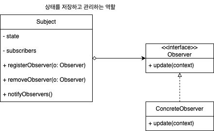
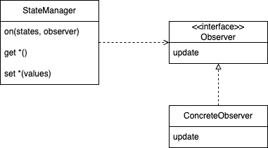

# 옵저버 패턴

객체 간의 일대다 관계를 정의하는 패턴

한 객체의 상태가 변경될 때 그 객체에 의존하는 객체들에게 변경을 알려주기

## 문제

시간이 지나면 변할 수 있는 상태를 가진 객체 A가 있고, 이 객체가 가진 상태를 사용해야 하는 다른 객체 B, C, D가 있다고 하자. A의 상태가 변경됐을 때, B, C, D는 어떻게 갱신된 상태를 알 수 있을까?

- 일정 시간마다 A의 상태를 확인한다
    - 확인 주기보다 A의 상태가 자주 변경되면, A의 상태와 싱크가 맞지 않을 수 있다
    - 확인 주기보다 A의 상태가 덜 변경되면, 불필요한 갱신이 너무 많이 일어날 수 있다
    - A의 상태가 공개되어야 한다
- A의 상태가 변경될 때 B, C, D에게 직접 알려주게 한다
    - 런타임 중에 A의 상태 변경을 받고 싶지 않아졌을 때도 B, C, D는 A의 상태를 받아야 한다
    - A가 B, C, D를 직접 알고 있어야 한다

## 해결

B, C, D를 A의 상태를 구독할 수 있는 옵저버로 만들고,  A의 상태가 변경될 때 옵저버에게 알려주도록 한다

- 런타임 중에도 A의 상태가 필요하면 구독을 시작하고, 필요하지 않아지면 구독을 끊을 수 있다
- A의 상태를 직접 공개하지 않아도 되고, A가 B, C, D를 직접 알지 않아도 된다
- A의 상태 변경이 일어나는 정확한 시점에 옵저버들이 알림을 받게 된다

## 구현

### 구조



- Subject: 상태를 저장하고 관리하는 주체
- Observer: Subject에 의존하며 상태 갱신을 기다림

Subject와 Observer는 일대다 관계를 가지며, 느슨하게 결합하게 됨

- 상호작용을 하지만, 서로에 대해서 자세히 알지 못하며 의존성이 최소화됨
- 옵저버는 언제든지 추가되거나 제거될 수 있다
- 옵저버에 변경이 생겨도 주제는 변경될 필요가 없다
- 주제와 옵저버는 서로 독립적으로 재사용할 수 있다
- 주제나 옵저버가 변경되어도 인터페이스만 만족시키면 서로에게 영향을 미치지 않는다

주의! 옵저버에 연락을 보내는 순서에 의존하면 안 된다.

```tsx
interface Observer<DATA_TYPE> {
    update: (data: DATA_TYPE) => void;
}

interface Subject<DATA_TYPE> {
    registerObserver: (o: Observer<DATA_TYPE>) => void;
    removeObserver: (o: Observer<DATA_TYPE>) => void;
    notifyObservers: () => void;
}

type BulbState = 'ON' | 'OFF' | 'BLINK'

interface BulbData {
    state: BulbState
}

class BulbManager implements Subject<BulbData> {
    private observers: Set<Observer<BulbData>> = new Set();
    private bulbData: BulbData = {
        state: 'OFF'
    }

    public setBulbState(state: BulbState) {
        this.bulbData.state = state;
        this.notifyObservers();
    }

    public notifyObservers(): void {
        this.observers.forEach(o => o.update(this.bulbData));
    }

    public registerObserver(o: Observer<BulbData>): void {
        this.observers.add(o);
    }

    public removeObserver(o: Observer<BulbData>): void {
        this.observers.delete(o);
    }
}

class BulbDisplay implements Observer<BulbData> {
    public update(data: BulbData): void {
        this.display(data.state);
    }

    public display(state: BulbState) {
        console.log(`display: ${state}`)
    }
}

const bulbManager = new BulbManager();
const bulbDisplay = new BulbDisplay();

bulbManager.registerObserver(bulbDisplay);

bulbManager.setBulbState('ON')
// 'display: ON'
```

### 다중 상태 주체(multi-state subject) - StateManager

하위 Subject를 포함하는 Composite Subject.

Observer는 여러 상태에서 발생하는 변경사항의 알림을 하나의 주체로부터 받을 수 있다.



```tsx
import EventEmitter from "events";

export class StateManager extends EventEmitter {
    constructor(private state: any) {
        super();
    }

    public set(key: string, value: any): void {
        const identifiers = key.split('.');
        const lastIndex = identifiers.length - 1;
        const node = this._get(identifiers.slice(0, lastIndex))
        node[identifiers[lastIndex]] = value;

        // notify
        identifiers.forEach((_, idx) => this.emit(identifiers.slice(0, idx + 1).join('.')))
    }
    public get(key: string): any {
        return this._get(key.split('.'))
    }

    private _get(identifiers: string[]): any {
        let node = this.state;
        identifiers.forEach(i => node[i] ?? (node = node[i]))
        return node;
    }

    on(state: string, listener: any): this;
    on(states: string[], listener: any): this;
    on(states: string | string[], listener: any): this {
        if (typeof states === 'string') {
            super.on(states, listener)
        } else {
            for (let state of states) {
                super.on(state, listener);
            }
        }
        return this;
    }
}

// client code
const stateManager = new StateManager({
      connected: false,
      loaded: false,
      foo: 'abc',
  })

stateManager.on(['connected', 'loaded'], () => {
    const disabled = stateManager.get('connected') && stateManager.get('loaded');
    console.log('disabled: ', disabled);
})

stateManager.set('connected', true); // disabled: false
stateManager.set('loaded', true); // disabled: true
```

## 특징

### 장점

- 객체 간의 결합을 느슨하게 만들어 코드의 재사용성을 높일 수 있다.
    - 옵저버가 listener 인터페이스를 구현한다는 것 외에는 서로에 대해 몰라도 된다
    - 주제의 변경 없이도 새로운 옵저버 클래스를 추가할 수 있다 - 개방/폐쇄 원칙
- 상태가 변경될 때마다 갱신할 수 있어 불필요한 갱신을 줄일 수 있다
- 런타임에 객체 간의 관계를 변경할 수 있다

### 단점

- 옵저버 객체의 구독을 끊어주지 않으면 주제 객체가 옵저버의 레퍼런스를 가지고 있어 가비지 컬렉션의 대상이 되지 않아 메모리 누수가 발생할 수 있음
- 순환 호출이 발생할 수 있다
- 옵저버가 알림을 받는 순서는 무작위이다

### 관련 패턴

- 중재자
    - 중재자: 컴포넌트 집합 간의 상호 의존성 제거. 컴포넌트들이 중재자 객체에만 의존하게 되는 구조
        - 옵저버 패턴으로 구현할 수도 있음
    - 옵저버: 객체들 간의 단방향 연결. 일대다 관계

## 사례

### Node.js [EventEmitter](https://nodejs.dev/en/learn/the-nodejs-event-emitter/)

- [https://subscription.packtpub.com/book/programming/9781783287314/1/ch01lvl1sec12/the-observer-pattern](https://subscription.packtpub.com/book/programming/9781783287314/1/ch01lvl1sec12/the-observer-pattern)

### MV* 아키텍처 패턴

- 비즈니스 로직에서 뷰를 분리하기 위해 옵저버 패턴을 사용
- [https://www.hanbit.co.kr/media/channel/view.html?cms_code=CMS2276009419&cate_cd=](https://www.hanbit.co.kr/media/channel/view.html?cms_code=CMS2276009419&cate_cd=)
- [https://copyprogramming.com/howto/mobx-observerable#observer-pattern-with-vanilla-js](https://copyprogramming.com/howto/mobx-observerable#observer-pattern-with-vanilla-js)

### Redux

- [https://www.thedevnotebook.com/2017/08/the-observer-pattern-in-javascript.html](https://www.thedevnotebook.com/2017/08/the-observer-pattern-in-javascript.html)

### MobX

- [https://ko.mobx.js.org/observable-state.html](https://ko.mobx.js.org/observable-state.html)
- [https://www.howdy-mj.me/mobx/mobx6-intro](https://www.howdy-mj.me/mobx/mobx6-intro)
    - observer func: [https://github.com/mobxjs/mobx/blob/7cdc7ecd6947a6da10f10d2e4a1305297b816007/packages/mobx-react-lite/src/observer.ts#LL60C22-L60C22](https://github.com/mobxjs/mobx/blob/7cdc7ecd6947a6da10f10d2e4a1305297b816007/packages/mobx-react-lite/src/observer.ts#LL60C22-L60C22)

### java.util.Observable

- 인터페이스가 아닌 클래스라서, 서브클래스를 만들어야 하므로 재사용성에 제약이 있음
- `setChanged` 가 protected라서, 외부에서 호출할 수 없음
- [https://xzio.tistory.com/289#:~:text=(2)-,WeatherData.java,-123](https://xzio.tistory.com/289#:~:text=(2)-,WeatherData.java,-1%0A2%0A3)
