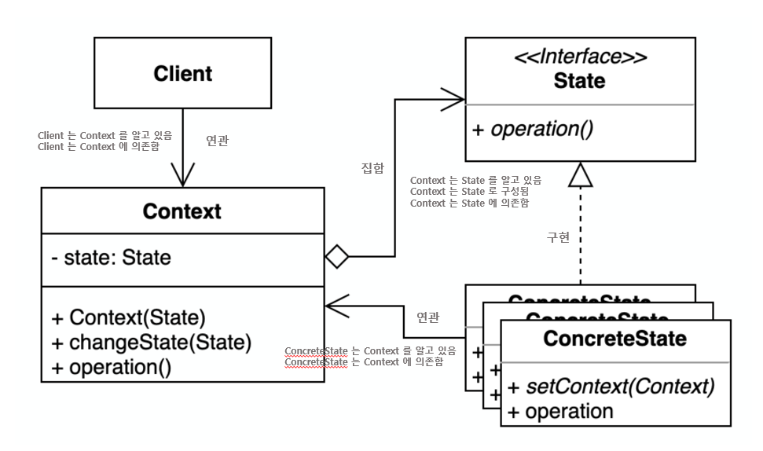

# State 패턴

## 개요

### 해결하고자 하는 문제

- 동일한 요청을 받을때, 객체의 현재 상태에 따라 다르게 동작하는 문제
- 어떤 처리에 상태에 따라 달라지는 분기 조건이 복잡하게 정의되어 있는 문제


### 문제해결 아이디어



- 상태에 따라 달라지는 처리를 상태 객체내부로 위임
  - State : Context의 각 상태별로 필요한 행동을 캡슐화하여 인터페이스로 정의
  - ConcreteState : Context의 상태 실제 처리내용을 구현
  - Context : 현재 상태를 저장하고, 상태 객체를 통해 각 처리를 호출함


### 구현방법

- Context 클래스 식별
- State 인터페이스 정의 (Context 에 선언된 상태별 분기 동작 메서드 미러링)
- 모든 실제 상태에 대한 ConcreteState 정의 + 상태별 분기 동작 메서드 구현
- Context 클래스의 분기 동작 메서드를 ConcreteState로 교체


### ASIS-TOBE 예제코드

```typescript
// Context
class Button {
  private currentState: 'on' | 'off' = 'off'

  public on() {
    if (this.currentState === 'on') {
      console.log("already turned on")
    } else {
      console.log("turned on")
      this.currentState = 'on'
    }
  }
  
  public off() {
    if (this.currentState === 'on') {
      console.log("turned off")
      this.currentState = 'off'
    } else {
      console.log("already turned off")
    }
  }
}
```
- 2개의 행동 안에서 2개의 상태를 구분해서 동작함
- 3번째 상태가 추가되는 순간, 각 행동 안에서의 조건문 분기가 추가됨
  - 3번째 행동이 추가될때도 동일한 상황 발생함


```typescript
// Context
class Button {
  constructor(private currentState: State = new OffState()) {}

  public setState(state: State) {
    this.currentState = state
  }
  
  public on() {
    this.currentState.on(this)
  }
  
  public off() {
    this.currentState.off(this)
  }
}

// State
interface State {
  public on(refButton: Button)
  public off(refButton: Button)
}

class OnState implements State {
  public on(refButton: Button) {
    console.log("already turned on")
  }

  public off(refButton: Button) {
    console.log("turned off")
    refButton.setState(new OffState())
  }
}

class OffState implements State {
  public on(refButton: Button) {
    console.log("turned on")
    refButton.setState(new OffState())
  }

  public off(refButton: Button) {
    console.log("already turned off")
  }
}
```
- 2개의 상태를 2개의 ConcreteState 클래스로 구분
- 각 ConcreteState 에서 실제 자신의 상태에서 해야할 행동을 수행함


### 장점
- 복잡한 ifelse 조건을 상태별 서브클래스로 이동 => 가장 큰 장점! (자연스럽게 SRP)
  - ASIS : 조건문 경우의 수가 최대 상태개수 x 행동개수 만큼 발생 가능  
      (최종 처리까지 도달하기까지가 매우 복잡해짐)
  - TOBE : 상태개수 만큼의 ConcreteState클래스 선언 + 각 ConcreteState 내부에 행둥개수 만큼의 메서드  
      (최종 처리까지의 도달이 단순해짐)
- 각 개별 상태클래스만 테스트할 수 있음
- 새로운 상태를 추가하는게 매우 편리함

### 단점
- 상태와 상태전이를 정의하기가 어려울 수 있음
- 상태가 적을때는 오버엔지니어링일 수 있음

### 유즈케이스
- 주로 복잡한 비즈니스로직을 작성할때 쉽게 발생할 수 있는 상태전이도 등을 구현할때 사용할 수 있음
- 생각보다 프레임워크에서는 잘 안보이는 것 같음


---
## 사용사례 (비즈니스 로직 중심)

### 게시판

```typescript
interface PostState {
  view()
  delete()
  update()
}

// 차단된 상태 (ConcreteState)
class ReadableState implements PostState {
  constructor(private readonly post: Post) {}

  view() { console.log(`조회 성공`) }
  delete() { console.log(`권한이 없습니다`) }
  update() { console.log(`권한이 없습니다`) }
}

// 내 게시글 (ConcreteState)
class OwnedState implements PostState {
  constructor(private readonly post: Post) {}

  view() { console.log(`조회성공`) }
  delete() {
    console.log(`삭제성공`)
    this.post.setState(new DeletedPost(this.post))
  }
  update() { console.log(`갱신성공`) }
}

// 삭제된 상태 (ConcreteState)
class DeletedState implements PostState {
  constructor(private readonly post: Post) {}

  view() { console.log(`삭제된 게시글은 볼 수 없습니다.`) }
  delete() { console.log(`유효하지 않은 접근입니다.`) }
  update() { console.log(`유효하지 않은 접근입니다`) }
}
```


### 주문결제

```typescript
interface PaymentState {
  selectPaymentMethod()
  processPayment()
  completePayment()
  failPayment()

  // ...
}

// 결제 수단 선택 상태 (ConcreteState)
class PaymentMethodSelectionState implements PaymentState {
  constructor(private readonly context:PaymentContext) {}

  public selectPaymentMethod() { console.log("이미 결제 수단이 선택되었습니다.") }
  public processPayment() { console.log("결제 수단을 선택하세요.") }
  public completePayment() { console.log("결제 수단을 선택해야 합니다.") }
  public failPayment() { console.log("결제 수단을 선택해야 합니다.") }
}

// 결제 처리 상태 (ConcreteState)
class PaymentProcessingState implements PaymentState {
  constructor(private readonly context:PaymentContext) {}

  public selectPaymentMethod() { console.log("이미 결제 수단이 선택되었습니다.") }
  public processPayment() { console.log("이미 결제가 진행 중입니다.") }
  public completePayment() { console.log("결제가 성공적으로 진행되었습니다.") }
  public failPayment() { console.log("결제가 실패했습니다.") }
}

// 결제 완료 상태 (ConcreteState)
class PaymentCompletedState implements PaymentState {}

// 결제 거절 상태 (ConcreteState)
class PaymentRejectedState implements PaymentState {}

// 환불 요청 상태 (ConcreteState)
class RefundRequestedState implements PaymentState {}

// 환불 취소 상태 (ConcreteState)
class RefundCancelledState implements PaymentState {}

// 환불 완료 상태 (ConcreteState)
class RefundCompletedState implements PaymentState {}
```


### 게임

```typescript
class Player {
  private speed:number = 0
  private state = new StandUpState(this)

  public setSpeed(speed:number) { this.speed = speed }
  public getSpeed() { return this.speed }

  public setState(state:PlayerState) { this.state = state }
  public getState() { return this.state }
}

abstract class PlayerState {
  constructor(protected readonly player: Player)

  standUp()
  sitDown()
  walk()
  run()
}

// 일어서 있는 상태 (ConcreteState)
class StandUpState implements PlayerState {
  standUp() {
    console.log('언제 움직일까요?')
  }
  sitDown() {
    console.log('앉으니깐 편하고 좋습니다.')
    this.player.setState(new SitDownState(this.player))
  }
  walk() { 
    console.log('걸어보겠습니다.')
    this.player.setSpeed(5)
    this.player.setState(new WalkState(this.player))
  }
  run() {
    console.log('뛰어보겠습니다.')
    this.player.setSpeed(10)
    this.player.setState(new RunState(this.player))
  }
}

// 앉아 있는 상태 (ConcreteState)
class SitDownState implements PlayerState {
  standUp() {
    console.log('일어나겠습니다.')
    this.player.setState(new StandUpState(this.player))
  }
  sitDown() {
    console.log('계속 앉아있으니깐 쥐가 날 것 같습니다.')
  }
  walk() {
    console.log('앉은 상태에서는 걸을 수 없습니다. 일단 일어서겠습니다')
    this.player.setState(new StandUpState(this.player))
  }
  run() {
    console.log('앉은 상태에서는 뛸 수 없습니다. 일단 일어서겠습니다')
    this.player.setState(new StandUpState(this.player))
  }
}

// 걷고 있는 상태 (ConcreteState)
class WalkState implements PlayerState {
  standUp() {
    console.log('일단 멈추겠습니다.')
    this.player.setSpeed(0)
    this.player.setState(new StandUpState(this.player))
  }
  sitDown() {
    console.log('갑자기 앉으면 넘어질 수 있습니다. 일단 멈추겠습니다.')
    this.player.setSpeed(0)
    this.player.setState(new StandUpState(this.player))
  }
  walk() { 
    console.log('지금 걷고있습니다')
  }
  run() {
    console.log('뛰니깐 숨이 찹니다')
    this.player.setSpeed(20)
    this.player.setState(new RunState(this.player))
  }
}

// 뛰고 있는 상태 (ConcreteState)
class RunState implements PlayerState {
  standUp() {
    console.log('갑자기 멈추면 다칠 수 있습니다.')
    this.player.setSpeed(0)
    this.player.setState(new StandUpState(this.player))
  }
  sitDown() {
    console.log('뛰고 있는데 갚자기 앉으면 다칩니다. 일단 멈추겠습니다.')
    this.player.setSpeed(0)
    this.player.setState(new StandUpState(this.player))
  }
  walk() { 
    console.log('속도를 줄이겠습니다.')
    this.player.setSpeed(8)
    this.player.setState(new WalkState(this.player))
  }
  run() {
    console.log('더 빨리 뛰겠습니다.')
    this.player.setSpeed(this.player.getSpeed() + 2)
  }
}
```


---
## 고려사항

### 누가 상태전이를 결정하는가

- 상태패턴은 상태전이에 대한 책임을 누가 가지는지에 대해서 명시하지 않음
- Context에서 결정한다면, 각 행동별 상태전이를 Context내부에 미리 정의해야함
- ConcreteState에서 결정한다면, 각 상태가 본인의 행동이 끝난 뒤에 전이될 다음 상태를 알고있어야함
- 일반적으로는 ConcreteState에서 상태전이가 발생하도록 하는 방법을 많이 사용함

### 상태객체의 생성과 소멸

- 상태객체를 필요할때만 생성하고 필요없게되면 없앨것인가
  - 상태가 실행되기 전까지는 어떤 상태여야하는지 모르거나, 상태가 자주 바뀌지 않는 상황일때 바람직
  - State 객체가 많은 정보를 담고있을때 매우 유용
- 필요하기 전에 미리 만들어 둔 후 없애지 않고 계속 둘 것인가
  - 변화가 수시로 일어날때 훨씬 좋은 방법
  - 단점은 Context클래스가 언제나 모든 상태에 대한 참조자를 계속 관리해야하는 부담이 생긴다는 점


---
## 참고 자료
- https://en.wikipedia.org/wiki/Finite-state_machine
- https://commons.wikimedia.org/wiki/File:Tcp_state_diagram_fixed_new.svg
- https://story.pxd.co.kr/1549

