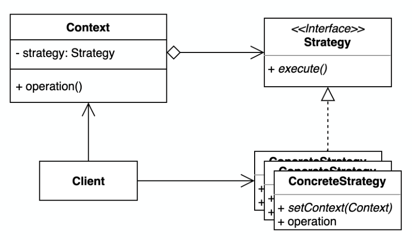

# Strategy 패턴

## 개요

- 동일 계열의 알고리즘 군을 정의 + 클라이언트와 상관없이 독립적으로 알고리즘을 상호교환


### 해결하고자 하는 문제

- 행동들이 조금씩 다를뿐, 개념적으로 유사한 알고리즘 클래스들을 "군" 으로 묶어서 관리해야할때
- 클라이언트 쪽에서 특정 알고리즘을 지정하여 내부동작이 이루어지도록 할때
- 문제 사례 시나리오
  ```
  1. 도로용 네비게이션 앱 개발
  2. 보행자 기능도 지원해달라는 요청이 많아서 보행자용 경로안내 기능 추가
  3. 보행자용 경로안내에 대중교통데이터 반영하는 옵션 추가
  4. 자전거용 경로안내 기능 추가 + 도시 관광 명소 추천기능 추가 (?!)
  5. 경로안내 메인 알고리즘을 변경 (??!)
  ```
  - 공통 기능(ex. 최단거리 알고리즘 등) 을 조금이라도 수정할때마다, 전체 클래스에 어떤 영향을 미치는지 확인해야함
  - 새로운 기능을 추가할때마다, 병합 충돌을 해결해야함
  - 경로찾기에 대한 각 세부기능별 구현 격리 필요


### 문제해결 아이디어



- 알고리즘에 해당하는 연산을 관련 데이터와 함께 Strategy클래스로 전달하는 구조
  - Strategy : 시스템에서 제공하는 모든 알고리즘에 대한 공통 인터페이스를 정의
  - ConcreteStrategy : 각각의 실제 알고리즘을 구현
  - Context : Strategy객체에 대한 참조를 관리


### ASIS-TOBE 예제코드
```typescript
/* DatabaseConnectionStrategy.js */
interface DatabaseConnectionStrategy {  // DB연결 전략에 대한 인터페이스 지정
  connect(): Promise<any>;
  disconnect(): Promise<any>;
}

/* MysqlConnectionStrategy.js */
class MysqlConnection implements DatabaseConnectionStrategy {  // 각 전략별 실제 구현체
  async connect(): Promise<any> {
    // MySQL 연결 코드
  }
  async disconnect(): Promise<any> {
    // MySQL 연결 종료 코드
  }
}

/* MongoConnectionStrategy.js */
class MongoConnection implements DatabaseConnectionStrategy {  // 각 전략별 실제 구현체
  async connect(): Promise<any> {
    // MongoDB 연결 코드
  }
  async disconnect(): Promise<any> {
    // MongoDB 연결 종료 코드
  }
}

/* DatabaseConnection.js */
class DatabaseConnection {
  constructor(private readonly databaseConnectionStrategy: DatabaseConnectionStrategy) {}  // 클라이언트로부터 전략객체를 주입받음
  async connect() {
    return this.databaseConnectionStrategy.connect(); // 주입받은 전략객체를 통해 실제 동작 수행
  }
  async disconnect() {
    return this.databaseConnectionStrategy.disconnect();
  }
}

/* Client.js */
const conn = new DatabaseConnection(new MysqlConnection());  // 클라이언트가 전략객체를 지정 + 컨텍스트로 전달
// const conn = new DatabaseConnection(new MongoConnection());

await conn.connect();  // 컨텍스트 동작 호출
await conn.disconnect();
```
- 컨텍스트에서 사용할 알고리즘(전략)을 클라이언트가 선택함
- 컨텍스트는 주입받은 전략객체를 통해 본래의 책임을 수행함 (공통 행위 인터페이스)


### 장점
- 정의되어있는 공통 알고리즘 군을 위임 구조를 통해 교체할 수 있음
  - 구현의 선택이 유연한 구조 (ex. 시간 ↔ 공간 trade-off)
- 새로운 전략을 추가하더라도 기존 코드를 변경하지 않음 + 런타임에 쉽게 교체할 수 있음

### 단점
- 클라이언트쪽에서 구체적인 Strategy를 알고있어야함


---
## 사용사례

### Java

```java
List<Integer> numbers = List.of(111, 333, 222);

Collection.sort(
  numbers,
  new Comparator<Integer>() {  // 어떻게 정렬할것인지에 대한 전략을 넘겨줌
    @Override
    public int compare(Integer o1, Integer o2) {
      return o1 - o2;
    }
  });
```
- https://github.com/openjdk-mirror/jdk7u-jdk/blob/master/src/share/classes/java/util/Collections.java#L215-L223
- https://github.com/frohoff/jdk8u-jdk/blob/master/src/share/classes/java/util/Comparator.java#L110-L150


### Nestjs

```typescript
const FacebookStrategyFactory = (strategy: Type, name: string) => {
  class BaseStrategy extends PassportStrategy(strategy, name) {
    public constructor(
      private readonly authUserService: AuthUserService,
      additionalOpts?: object,
    ) {
      super({ ... })
    }

    public async validate(/* ... */) {
      // ...
    }

    private async handleUser(/* ... */) {
      // if exist: 조회된 유저정보 반환
      // else: fb유저 생성 + 신규생성 유저정보 반환
    }
  }

  return BaseStrategy as new(
    authUserService: AuthUserService,
    additionalOpts?: object,
  ) => { }
}

@Injectable()
export class FacebookStrategy extends FacebookStrategyFactory(FBStrategy, "facebook") {
  public constructor(authUserService: AuthUserService) {
    super(authUserService)
  }
}

@Injectable()
export class FacebookTokenStrategy extends FacebookStrategyFactory(FBTokenStrategy, "facebook-token") {
  public constructor(authUserService: AuthUserService) {
    super(authUserService, {
      accessTokenField: "accessToken",
      refreshTokenField: "refreshToken",
    })
  }
}
```
```typescript
@Controller("/api/auth")
export class AuthController {
  @Get("/facebook")
  @PassportAuthenticate("facebook")
  public authFacebook() {
    // ...
  }

  @Post("/facebook/token")
  @PassportAuthenticate("facebook-token")
  public authFacebookToken() {
    // ...
  }
}
```
- 사용자 인증 절차에 적절한 전략을 교체해서 사용가능


### OpenSSL
```bash
➜ openssl s_client -connect gg.go.kr:443 -state -tls1_2 -tlsextdebug
CONNECTED(00000003)
SSL_connect:before SSL initialization
SSL_connect:SSLv3/TLS write client hello
SSL_connect:SSLv3/TLS write client hello
TLS server extension "renegotiation info" (id=65281), len=1
0000 - 00                                                .
TLS server extension "EC point formats" (id=11), len=4
0000 - 03 00 01 02                                       ....
TLS server extension "extended master secret" (id=23), len=0
SSL_connect:SSLv3/TLS read server hello
depth=0 C = KR, ST = Gyeonggi-do, O = GYEONGGI PROVINCIAL GOVERNMENT, CN = *.gg.go.kr
verify error:num=20:unable to get local issuer certificate
verify return:1
depth=0 C = KR, ST = Gyeonggi-do, O = GYEONGGI PROVINCIAL GOVERNMENT, CN = *.gg.go.kr
verify error:num=21:unable to verify the first certificate
verify return:1
SSL_connect:SSLv3/TLS read server certificate
SSL_connect:SSLv3/TLS read server key exchange
SSL_connect:SSLv3/TLS read server done
SSL_connect:SSLv3/TLS write client key exchange
SSL_connect:SSLv3/TLS write change cipher spec
SSL_connect:SSLv3/TLS write finished
SSL_connect:SSLv3/TLS write finished
SSL_connect:SSLv3/TLS read change cipher spec
SSL_connect:SSLv3/TLS read finished
---
Certificate chain
 0 s:C = KR, ST = Gyeonggi-do, O = GYEONGGI PROVINCIAL GOVERNMENT, CN = *.gg.go.kr
   i:C = GB, ST = Greater Manchester, L = Salford, O = Sectigo Limited, CN = Sectigo RSA Organization Validation Secure Server CA
---
Server certificate
-----BEGIN CERTIFICATE-----
MIIG2jCCBcKgAwIBAgIQcZ2KmsDO9psLQwXkipR2RjANBgkqhkiG9w0BAQsFADCB
lTELMAkGA1UEBhMCR0IxGzAZBgNVBAgTEkdyZWF0ZXIgTWFuY2hlc3RlcjEQMA4G
A1UEBxMHU2FsZm9yZDEYMBYGA1UEChMPU2VjdGlnbyBMaW1pdGVkMT0wOwYDVQQD
EzRTZWN0aWdvIFJTQSBPcmdhbml6YXRpb24gVmFsaWRhdGlvbiBTZWN1cmUgU2Vy
dmVyIENBMB4XDTIyMDQxODAwMDAwMFoXDTIzMDUxMDIzNTk1OVowYTELMAkGA1UE
BhMCS1IxFDASBgNVBAgTC0d5ZW9uZ2dpLWRvMScwJQYDVQQKEx5HWUVPTkdHSSBQ
Uk9WSU5DSUFMIEdPVkVSTk1FTlQxEzARBgNVBAMMCiouZ2cuZ28ua3IwggEiMA0G
CSqGSIb3DQEBAQUAA4IBDwAwggEKAoIBAQDbMDi6dnmqkzUcv6iyTOMsvrh9Cv2t
G2O4aAoyGRij8Ki4IWNIMpGD9YmLgpeEtdmpjID7qJ6yyfH1rxcpVVM5AzcGHTe/
P+xiWsy7GEOdVo2Da/Vjv3vqaU+JSAvboEqow+a3EO6ZLBVR/ZN1nImVOLzvLMs/
qG1bSoR3t9BYxhjjBay4iQFuHIhzb6xH24W1AfcTM9yeGoGgKVVbqE7wdXSTDTdO
1rlGdepZ9tinikuKzrHgntzMiDqDlSyeyiQXvTkF7Dc6x9+dBd2JTRUy8582+eu4
Lpgb2UVKqIbjsIZhgN36j8Oucg4yt5b6zsc/5bHX5pl3Nv9nYeb24Rq/AgMBAAGj
ggNXMIIDUzAfBgNVHSMEGDAWgBQX2dYlJ2f5McJJQ9kwNkSMbKlP6zAdBgNVHQ4E
FgQUp4Ko5pzCGaBKixaoYrUvi5JcdokwDgYDVR0PAQH/BAQDAgWgMAwGA1UdEwEB
/wQCMAAwHQYDVR0lBBYwFAYIKwYBBQUHAwEGCCsGAQUFBwMCMEoGA1UdIARDMEEw
NQYMKwYBBAGyMQECAQMEMCUwIwYIKwYBBQUHAgEWF2h0dHBzOi8vc2VjdGlnby5j
b20vQ1BTMAgGBmeBDAECAjBaBgNVHR8EUzBRME+gTaBLhklodHRwOi8vY3JsLnNl
Y3RpZ28uY29tL1NlY3RpZ29SU0FPcmdhbml6YXRpb25WYWxpZGF0aW9uU2VjdXJl
U2VydmVyQ0EuY3JsMIGKBggrBgEFBQcBAQR+MHwwVQYIKwYBBQUHMAKGSWh0dHA6
Ly9jcnQuc2VjdGlnby5jb20vU2VjdGlnb1JTQU9yZ2FuaXphdGlvblZhbGlkYXRp
b25TZWN1cmVTZXJ2ZXJDQS5jcnQwIwYIKwYBBQUHMAGGF2h0dHA6Ly9vY3NwLnNl
Y3RpZ28uY29tMB8GA1UdEQQYMBaCCiouZ2cuZ28ua3KCCGdnLmdvLmtyMIIBfAYK
KwYBBAHWeQIEAgSCAWwEggFoAWYAdgCt9776fP8QyIudPZwePhhqtGcpXc+xDCTK
hYY069yCigAAAYA9bJYyAAAEAwBHMEUCIH8LgZ+6PDvKkjsw2qsY2lsb/hxSKbQ6
bLPWHtwhxRjaAiEA/rPv40D6AclCRSbj7JUDb7z/39tNScOHxX6dwhgdlfEAdQB6
MoxU2LcttiDqOOBSHumEFnAyE4VNO9IrwTpXo1LrUgAAAYA9bJX4AAAEAwBGMEQC
IGDdXhHQ80YX+90yGK5tir8MQxKaw2gkfKOToGlUQuEEAiBCVWAeMrEsqKjFY9dI
4+4XXL2voyq5WdqftHIew+zdcQB1AOg+0No+9QY1MudXKLyJa8kD08vREWvs62nh
d31tBr1uAAABgD1slcgAAAQDAEYwRAIgSdGdCxjVXrdktzrj1nJ+wI4fSHorIp5i
2oKcbdDmK9kCIFPpIgIrTeMMSRqNoRHI3wB8wl59aEff6jMcE0Ey+KlnMA0GCSqG
SIb3DQEBCwUAA4IBAQAFUQpuQYa1eKHwuc2J+lAvrn6t8uYLjwqDCTqXTue/KDT1
yE5kEmvByQdmO8inWpBWjZQSj2UxqKKtts2+TqUIbJjjop85pqDb4eh4uGiHakbj
dVRScYgQMr+GF4oo1p0UkpmkA8uAKU5D4XWpjeHkzoZMlNGXm9rafm8KqRtjXxTg
CSFLb2u3o0oy4y5mFNF9jl84c16Mmqwe00WWiK4Ce0/pMx7JMbuxNlwro43cBq4h
TMhOd9d6qxMZVoAjQK0Z28u67YqoBF1Nq/fS42+MDS93IXMOc427o1cGjQtcPYni
8qMUG2eYfPwKMS7NyJaKJ/zgxBhCicO32iSqUYiH
-----END CERTIFICATE-----
subject=C = KR, ST = Gyeonggi-do, O = GYEONGGI PROVINCIAL GOVERNMENT, CN = *.gg.go.kr

issuer=C = GB, ST = Greater Manchester, L = Salford, O = Sectigo Limited, CN = Sectigo RSA Organization Validation Secure Server CA

---
No client certificate CA names sent
Peer signing digest: SHA256
Peer signature type: RSA-PSS
Server Temp Key: X25519, 253 bits
---
SSL handshake has read 2236 bytes and written 298 bytes
Verification error: unable to verify the first certificate
---
New, TLSv1.2, Cipher is ECDHE-RSA-AES256-GCM-SHA384
Server public key is 2048 bit
Secure Renegotiation IS supported
Compression: NONE
Expansion: NONE
No ALPN negotiated
SSL-Session:
    Protocol  : TLSv1.2
    Cipher    : ECDHE-RSA-AES256-GCM-SHA384
    Session-ID: F4F06D4785F8FF749A271092F4A6F9A3E5F3BABB509732A9C20EE788A3545CF1
    Session-ID-ctx: 
    Master-Key: 99E82F7B4113EC830098DD0FD9CE5FBBFB5CE03C70D8468A108D9D3AB345173179EACD0B06853F8679614A11F382FF1A
    PSK identity: None
    PSK identity hint: None
    SRP username: None
    Start Time: 1680093254
    Timeout   : 7200 (sec)
    Verify return code: 21 (unable to verify the first certificate)
    Extended master secret: yes
---
...
```

```bash
➜ openssl s_client -connect naver.com:443 -state -tls1_2 -tlsextdebug
CONNECTED(00000003)
SSL_connect:before SSL initialization
SSL_connect:SSLv3/TLS write client hello
SSL_connect:SSLv3/TLS write client hello
TLS server extension "renegotiation info" (id=65281), len=1
0000 - 00                                                .
TLS server extension "server name" (id=0), len=0
TLS server extension "EC point formats" (id=11), len=4
0000 - 03 00 01 02                                       ....
TLS server extension "session ticket" (id=35), len=0
TLS server extension "extended master secret" (id=23), len=0
SSL_connect:SSLv3/TLS read server hello
depth=2 C = US, O = DigiCert Inc, OU = www.digicert.com, CN = DigiCert Global Root CA
verify return:1
depth=1 C = US, O = DigiCert Inc, CN = DigiCert TLS RSA SHA256 2020 CA1
verify return:1
depth=0 C = KR, ST = Gyeonggi-do, L = Seongnam-si, O = NAVER Corp., CN = www.naver.net
verify return:1
SSL_connect:SSLv3/TLS read server certificate
SSL_connect:SSLv3/TLS read server key exchange
SSL_connect:SSLv3/TLS read server done
SSL_connect:SSLv3/TLS write client key exchange
SSL_connect:SSLv3/TLS write change cipher spec
SSL_connect:SSLv3/TLS write finished
SSL_connect:SSLv3/TLS write finished
SSL_connect:SSLv3/TLS read server session ticket
SSL_connect:SSLv3/TLS read change cipher spec
SSL_connect:SSLv3/TLS read finished
---
Certificate chain
 0 s:C = KR, ST = Gyeonggi-do, L = Seongnam-si, O = NAVER Corp., CN = www.naver.net
   i:C = US, O = DigiCert Inc, CN = DigiCert TLS RSA SHA256 2020 CA1
 1 s:C = US, O = DigiCert Inc, CN = DigiCert TLS RSA SHA256 2020 CA1
   i:C = US, O = DigiCert Inc, OU = www.digicert.com, CN = DigiCert Global Root CA
 2 s:C = US, O = DigiCert Inc, OU = www.digicert.com, CN = DigiCert Global Root CA
   i:C = US, O = DigiCert Inc, OU = www.digicert.com, CN = DigiCert Global Root CA
---
Server certificate
-----BEGIN CERTIFICATE-----
MIIHMjCCBhqgAwIBAgIQB/KFIVOxUGfjxneqOoO+3TANBgkqhkiG9w0BAQsFADBP
MQswCQYDVQQGEwJVUzEVMBMGA1UEChMMRGlnaUNlcnQgSW5jMSkwJwYDVQQDEyBE
aWdpQ2VydCBUTFMgUlNBIFNIQTI1NiAyMDIwIENBMTAeFw0yMjA1MjMwMDAwMDBa
Fw0yMzA2MDcyMzU5NTlaMGcxCzAJBgNVBAYTAktSMRQwEgYDVQQIEwtHeWVvbmdn
aS1kbzEUMBIGA1UEBxMLU2VvbmduYW0tc2kxFDASBgNVBAoTC05BVkVSIENvcnAu
MRYwFAYDVQQDEw13d3cubmF2ZXIubmV0MIIBIjANBgkqhkiG9w0BAQEFAAOCAQ8A
MIIBCgKCAQEA1S+J/Xr1L99igoQsay+6VRvepZ1pusPPpYX/qq7uFV9xyeUpMrty
pH2Hh9yO/ujnputVXnmK94gMmlHOP5TtOQh5INH/sBQvULIceV5TEl9BgfKSZHWJ
W95ioDUDKzRgkaJofK9QR559xVMTpfoBXMyUx8A0FRGWUtXBpNr4pJ0RLBpbkaXO
UsPb/NSvSpsKmUnamhBxx3xKUdFjYDH6hRbNvw5oitXyGO+G8/4ydYN3b9tGt+Mf
Pku20HGQjv68DN7fvJh5W+cOXQniJx9WTUbMf/UB1se+M1OvR0qnNCyUIun87P4U
HGhCHJihzlUKZnQQ+wxpgcTXXQeBEiXXbQIDAQABo4ID8DCCA+wwHwYDVR0jBBgw
FoAUt2ui6qiqhIx56rTaD5iyxZV2ufQwHQYDVR0OBBYEFPU8ExTJexU2UIw+iUDu
LOAiL55hMIGaBgNVHREEgZIwgY+CDXd3dy5uYXZlci5uZXSCDnd3dy5uYXZlci5h
c2lhggx3d3cubmF2ZXIuY2+CDHd3dy5uYXZlci5rcoIPd3d3Lm5hdmVyLmNvLmty
ggluYXZlci5jb22CCW5hdmVyLm5ldIIKbmF2ZXIuYXNpYYIIbmF2ZXIuY2+CCG5h
dmVyLmtyggtuYXZlci5jby5rcjAOBgNVHQ8BAf8EBAMCBaAwHQYDVR0lBBYwFAYI
KwYBBQUHAwEGCCsGAQUFBwMCMIGPBgNVHR8EgYcwgYQwQKA+oDyGOmh0dHA6Ly9j
cmwzLmRpZ2ljZXJ0LmNvbS9EaWdpQ2VydFRMU1JTQVNIQTI1NjIwMjBDQTEtNC5j
cmwwQKA+oDyGOmh0dHA6Ly9jcmw0LmRpZ2ljZXJ0LmNvbS9EaWdpQ2VydFRMU1JT
QVNIQTI1NjIwMjBDQTEtNC5jcmwwPgYDVR0gBDcwNTAzBgZngQwBAgIwKTAnBggr
BgEFBQcCARYbaHR0cDovL3d3dy5kaWdpY2VydC5jb20vQ1BTMH8GCCsGAQUFBwEB
BHMwcTAkBggrBgEFBQcwAYYYaHR0cDovL29jc3AuZGlnaWNlcnQuY29tMEkGCCsG
AQUFBzAChj1odHRwOi8vY2FjZXJ0cy5kaWdpY2VydC5jb20vRGlnaUNlcnRUTFNS
U0FTSEEyNTYyMDIwQ0ExLTEuY3J0MAkGA1UdEwQCMAAwggF+BgorBgEEAdZ5AgQC
BIIBbgSCAWoBaAB1AOg+0No+9QY1MudXKLyJa8kD08vREWvs62nhd31tBr1uAAAB
gO/oEwIAAAQDAEYwRAIgVVu9Q2IQPrumWbnBPg1iVKb7xOeU5HVkXptl0grd/nQC
IFZKiikJCEyNfaPTki4WsEA+WSEG2Fq93TStfuGqT+hjAHcANc8ZG7+xbFe/D61M
bULLu7YnICZR6j/hKu+oA8M71kwAAAGA7+gTNgAABAMASDBGAiEAgq3KTF/G0Hr+
3GM6/X7QOYM99F9oQhaQdtz8GBAyn9oCIQDoEKotuSxhCNbmS1Sx1CftLoCUsbw2
5/gdpXEK0Q+uxQB2ALc++yTfnE26dfI5xbpY9Gxd/ELPep81xJ4dCYEl7bSZAAAB
gO/oEy0AAAQDAEcwRQIgULen3W0tGvt89fIZ9p3WWkcdHTMXg3+2r6ygZxh4FqQC
IQCqBzEIXLobv9sPKl1DVgYGwFEq4rGIbgkLCF/zd857uzANBgkqhkiG9w0BAQsF
AAOCAQEALk1MaHSCcKenLgO9/2mdmYztIPzjD9WAvTKv/YFYXvILUSUkCuLcbEGB
FOxsefr9h5dyTA4tdnelbncE18CZw550ifwHs8Ja6m3Vw6BdpRLOtbYB+InFrDE/
FTIXiQQHKk+LBvEqASgzDcOn0Jr/WzCyNCl4YnfevYj+xud1naM32lrvM3Fyp2G/
uFnsWCz1gQq5w554fjzQM5FT+jY2hFkq7pYRw9g8jow5b8G3GEKNJ+pG33v1K9/+
4mZbNHqLmaf/WToig4zIgeN78b8J45FUVjqA1IVxFTNYISB+4iVKI8F3G7LfkrOX
cWzuiSyRVW5CBlA9ygAmGC0ZwgpCJQ==
-----END CERTIFICATE-----
subject=C = KR, ST = Gyeonggi-do, L = Seongnam-si, O = NAVER Corp., CN = www.naver.net

issuer=C = US, O = DigiCert Inc, CN = DigiCert TLS RSA SHA256 2020 CA1

---
No client certificate CA names sent
Peer signing digest: SHA256
Peer signature type: RSA-PSS
Server Temp Key: X25519, 253 bits
---
SSL handshake has read 4678 bytes and written 299 bytes
Verification: OK
---
New, TLSv1.2, Cipher is ECDHE-RSA-AES128-GCM-SHA256
Server public key is 2048 bit
Secure Renegotiation IS supported
Compression: NONE
Expansion: NONE
No ALPN negotiated
SSL-Session:
    Protocol  : TLSv1.2
    Cipher    : ECDHE-RSA-AES128-GCM-SHA256
    Session-ID: C008E72D2EF97B304ECC9B1DE2BD1AFE1783D20F0ED72B2FD0FFE898AEE554CE
    Session-ID-ctx: 
    Master-Key: 6D31088844AB4FA0BD7F2478EA3CA444F661682B34D7E4DD60E56593E61F368C74E0B40B2A2474A10E86C971A5A52988
    PSK identity: None
    PSK identity hint: None
    SRP username: None
    TLS session ticket lifetime hint: 86400 (seconds)
    TLS session ticket:
    0000 - 90 8b 37 23 c8 ca 9b cf-a9 59 b8 2f f6 c2 57 3c   ..7#.....Y./..W<
    0010 - 5b 8e 9d 99 38 20 f7 a9-fe 35 2c 7a d6 f1 c6 39   [...8 ...5,z...9
    0020 - e3 e6 f3 af 03 6a 96 ed-da ba 2c ca b6 d7 92 b7   .....j....,.....
    0030 - 4c 1a b0 9e 4f 18 08 50-a1 a7 e3 0e aa df fd bb   L...O..P........
    0040 - 22 59 15 af 33 9e d9 4e-12 9d 75 1f 10 e0 e3 aa   "Y..3..N..u.....
    0050 - 98 45 3a 90 4c 83 6b 26-de 5a 0f 9a b3 ea f9 36   .E:.L.k&.Z.....6
    0060 - 29 81 e1 2e 56 d6 54 b6-c2 b7 14 d5 25 79 3f 65   )...V.T.....%y?e
    0070 - 16 f9 56 2d 04 d6 b7 1d-83 04 9f 08 e8 5d c7 3b   ..V-.........].;
    0080 - 66 f9 49 ef 7f 1b cd c0-8e 76 66 fc 54 53 cf 43   f.I......vf.TS.C
    0090 - 02 40 0f 13 f1 f4 a5 8c-b9 c6 7e 53 eb 8c 6d d0   .@........~S..m.
    00a0 - d8 4a 08 c4 ce c2 b9 a6-35 02 a2 38 f5 f3 84 cc   .J......5..8....
    00b0 - f2 79 63 b4 0b 16 32 aa-b7 ab 86 f1 b4 e4 1f 2d   .yc...2........-

    Start Time: 1680093312
    Timeout   : 7200 (sec)
    Verify return code: 0 (ok)
    Extended master secret: yes
---
SSL3 alert read:warning:close notify
closed
SSL3 alert write:warning:close notify
...
```

```bash
➜ openssl s_client -connect naver.com:443 -state -tls1_3 -tlsextdebug
CONNECTED(00000003)
SSL_connect:before SSL initialization
SSL_connect:SSLv3/TLS write client hello
SSL_connect:SSLv3/TLS write client hello
TLS server extension "supported versions" (id=43), len=2
0000 - 03 04                                             ..
TLS server extension "key share" (id=51), len=36
0000 - 00 1d 00 20 ea 8b 64 77-ce 11 34 01 0e af d4 e2   ... ..dw..4.....
0010 - 5d 51 94 d2 37 38 5f 90-bf 07 5c f5 d2 6e 8d 49   ]Q..78_...\..n.I
0020 - 01 58 a7 2d                                       .X.-
SSL_connect:SSLv3/TLS read server hello
TLS server extension "server name" (id=0), len=0
SSL_connect:TLSv1.3 read encrypted extensions
depth=2 C = US, O = DigiCert Inc, OU = www.digicert.com, CN = DigiCert Global Root CA
verify return:1
depth=1 C = US, O = DigiCert Inc, CN = DigiCert TLS RSA SHA256 2020 CA1
verify return:1
depth=0 C = KR, ST = Gyeonggi-do, L = Seongnam-si, O = NAVER Corp., CN = www.naver.net
verify return:1
SSL_connect:SSLv3/TLS read server certificate
SSL_connect:TLSv1.3 read server certificate verify
SSL_connect:SSLv3/TLS read finished
SSL_connect:SSLv3/TLS write change cipher spec
SSL_connect:SSLv3/TLS write finished
---
Certificate chain
 0 s:C = KR, ST = Gyeonggi-do, L = Seongnam-si, O = NAVER Corp., CN = www.naver.net
   i:C = US, O = DigiCert Inc, CN = DigiCert TLS RSA SHA256 2020 CA1
 1 s:C = US, O = DigiCert Inc, CN = DigiCert TLS RSA SHA256 2020 CA1
   i:C = US, O = DigiCert Inc, OU = www.digicert.com, CN = DigiCert Global Root CA
 2 s:C = US, O = DigiCert Inc, OU = www.digicert.com, CN = DigiCert Global Root CA
   i:C = US, O = DigiCert Inc, OU = www.digicert.com, CN = DigiCert Global Root CA
---
Server certificate
-----BEGIN CERTIFICATE-----
MIIHMjCCBhqgAwIBAgIQB/KFIVOxUGfjxneqOoO+3TANBgkqhkiG9w0BAQsFADBP
MQswCQYDVQQGEwJVUzEVMBMGA1UEChMMRGlnaUNlcnQgSW5jMSkwJwYDVQQDEyBE
aWdpQ2VydCBUTFMgUlNBIFNIQTI1NiAyMDIwIENBMTAeFw0yMjA1MjMwMDAwMDBa
Fw0yMzA2MDcyMzU5NTlaMGcxCzAJBgNVBAYTAktSMRQwEgYDVQQIEwtHeWVvbmdn
aS1kbzEUMBIGA1UEBxMLU2VvbmduYW0tc2kxFDASBgNVBAoTC05BVkVSIENvcnAu
MRYwFAYDVQQDEw13d3cubmF2ZXIubmV0MIIBIjANBgkqhkiG9w0BAQEFAAOCAQ8A
MIIBCgKCAQEA1S+J/Xr1L99igoQsay+6VRvepZ1pusPPpYX/qq7uFV9xyeUpMrty
pH2Hh9yO/ujnputVXnmK94gMmlHOP5TtOQh5INH/sBQvULIceV5TEl9BgfKSZHWJ
W95ioDUDKzRgkaJofK9QR559xVMTpfoBXMyUx8A0FRGWUtXBpNr4pJ0RLBpbkaXO
UsPb/NSvSpsKmUnamhBxx3xKUdFjYDH6hRbNvw5oitXyGO+G8/4ydYN3b9tGt+Mf
Pku20HGQjv68DN7fvJh5W+cOXQniJx9WTUbMf/UB1se+M1OvR0qnNCyUIun87P4U
HGhCHJihzlUKZnQQ+wxpgcTXXQeBEiXXbQIDAQABo4ID8DCCA+wwHwYDVR0jBBgw
FoAUt2ui6qiqhIx56rTaD5iyxZV2ufQwHQYDVR0OBBYEFPU8ExTJexU2UIw+iUDu
LOAiL55hMIGaBgNVHREEgZIwgY+CDXd3dy5uYXZlci5uZXSCDnd3dy5uYXZlci5h
c2lhggx3d3cubmF2ZXIuY2+CDHd3dy5uYXZlci5rcoIPd3d3Lm5hdmVyLmNvLmty
ggluYXZlci5jb22CCW5hdmVyLm5ldIIKbmF2ZXIuYXNpYYIIbmF2ZXIuY2+CCG5h
dmVyLmtyggtuYXZlci5jby5rcjAOBgNVHQ8BAf8EBAMCBaAwHQYDVR0lBBYwFAYI
KwYBBQUHAwEGCCsGAQUFBwMCMIGPBgNVHR8EgYcwgYQwQKA+oDyGOmh0dHA6Ly9j
cmwzLmRpZ2ljZXJ0LmNvbS9EaWdpQ2VydFRMU1JTQVNIQTI1NjIwMjBDQTEtNC5j
cmwwQKA+oDyGOmh0dHA6Ly9jcmw0LmRpZ2ljZXJ0LmNvbS9EaWdpQ2VydFRMU1JT
QVNIQTI1NjIwMjBDQTEtNC5jcmwwPgYDVR0gBDcwNTAzBgZngQwBAgIwKTAnBggr
BgEFBQcCARYbaHR0cDovL3d3dy5kaWdpY2VydC5jb20vQ1BTMH8GCCsGAQUFBwEB
BHMwcTAkBggrBgEFBQcwAYYYaHR0cDovL29jc3AuZGlnaWNlcnQuY29tMEkGCCsG
AQUFBzAChj1odHRwOi8vY2FjZXJ0cy5kaWdpY2VydC5jb20vRGlnaUNlcnRUTFNS
U0FTSEEyNTYyMDIwQ0ExLTEuY3J0MAkGA1UdEwQCMAAwggF+BgorBgEEAdZ5AgQC
BIIBbgSCAWoBaAB1AOg+0No+9QY1MudXKLyJa8kD08vREWvs62nhd31tBr1uAAAB
gO/oEwIAAAQDAEYwRAIgVVu9Q2IQPrumWbnBPg1iVKb7xOeU5HVkXptl0grd/nQC
IFZKiikJCEyNfaPTki4WsEA+WSEG2Fq93TStfuGqT+hjAHcANc8ZG7+xbFe/D61M
bULLu7YnICZR6j/hKu+oA8M71kwAAAGA7+gTNgAABAMASDBGAiEAgq3KTF/G0Hr+
3GM6/X7QOYM99F9oQhaQdtz8GBAyn9oCIQDoEKotuSxhCNbmS1Sx1CftLoCUsbw2
5/gdpXEK0Q+uxQB2ALc++yTfnE26dfI5xbpY9Gxd/ELPep81xJ4dCYEl7bSZAAAB
gO/oEy0AAAQDAEcwRQIgULen3W0tGvt89fIZ9p3WWkcdHTMXg3+2r6ygZxh4FqQC
IQCqBzEIXLobv9sPKl1DVgYGwFEq4rGIbgkLCF/zd857uzANBgkqhkiG9w0BAQsF
AAOCAQEALk1MaHSCcKenLgO9/2mdmYztIPzjD9WAvTKv/YFYXvILUSUkCuLcbEGB
FOxsefr9h5dyTA4tdnelbncE18CZw550ifwHs8Ja6m3Vw6BdpRLOtbYB+InFrDE/
FTIXiQQHKk+LBvEqASgzDcOn0Jr/WzCyNCl4YnfevYj+xud1naM32lrvM3Fyp2G/
uFnsWCz1gQq5w554fjzQM5FT+jY2hFkq7pYRw9g8jow5b8G3GEKNJ+pG33v1K9/+
4mZbNHqLmaf/WToig4zIgeN78b8J45FUVjqA1IVxFTNYISB+4iVKI8F3G7LfkrOX
cWzuiSyRVW5CBlA9ygAmGC0ZwgpCJQ==
-----END CERTIFICATE-----
subject=C = KR, ST = Gyeonggi-do, L = Seongnam-si, O = NAVER Corp., CN = www.naver.net

issuer=C = US, O = DigiCert Inc, CN = DigiCert TLS RSA SHA256 2020 CA1

---
No client certificate CA names sent
Peer signing digest: SHA256
Peer signature type: RSA-PSS
Server Temp Key: X25519, 253 bits
---
SSL handshake has read 4581 bytes and written 313 bytes
Verification: OK
---
New, TLSv1.3, Cipher is TLS_AES_256_GCM_SHA384
Server public key is 2048 bit
Secure Renegotiation IS NOT supported
Compression: NONE
Expansion: NONE
No ALPN negotiated
Early data was not sent
Verify return code: 0 (ok)
---
SSL_connect:SSL negotiation finished successfully
SSL_connect:SSL negotiation finished successfully
---
Post-Handshake New Session Ticket arrived:
SSL-Session:
    Protocol  : TLSv1.3
    Cipher    : TLS_AES_256_GCM_SHA384
    Session-ID: 8A168441833C455E5EB80C1729B5AF58F20A871C33C53D3D27EE7514ECA501B5
    Session-ID-ctx:
    Resumption PSK: 2842F8ECAC90782F46B5BD3A25695E7A6DC7F02ABB9BB1B00DC00E91130E623F7911648917056DCB0E6593AF5A10900E
    PSK identity: None
    PSK identity hint: None
    SRP username: None
    TLS session ticket lifetime hint: 86400 (seconds)
    TLS session ticket:
    0000 - a2 59 9a d0 22 4f 50 2d-d0 7d 0a f9 c9 58 fc ab   .Y.."OP-.}...X..
    0010 - 96 6a 0c df 4a 8f d0 19-aa 31 12 0d 90 2e 2f 80   .j..J....1..../.
    0020 - a4 0f 59 94 b6 d1 ea 8b-b9 8f 27 84 2e 2a 6f e1   ..Y.......'..*o.
    0030 - d5 f4 bc 9f 91 f5 d8 b3-d7 2d 40 80 04 a0 17 85   .........-@.....
    0040 - e1 2a 5a 2d b0 4d 42 c7-f5 ae c6 d4 7e 03 5b 25   .*Z-.MB.....~.[%
    0050 - d5 b3 a0 42 3d 23 c9 36-1a 65 b7 2e 8d 65 ed 4b   ...B=#.6.e...e.K
    0060 - 9f e7 9b 2f 24 83 54 f4-13 05 77 4e 12 90 3f 6b   .../$.T...wN..?k
    0070 - 20 7e 46 88 66 e8 11 10-86 59 2e 15 cb 1a 5f 1d    ~F.f....Y...._.
    0080 - 7f 07 62 e1 7e f9 7a 68-55 7a a3 50 79 67 bd 67   ..b.~.zhUz.Pyg.g
    0090 - 21 aa ac c3 9e 7a 39 3d-0f 4a 7c 01 e2 28 49 53   !....z9=.J|..(IS
    00a0 - 7a 53 8b de 25 e3 c1 3e-02 29 76 dd e7 e7 fd 43   zS..%..>.)v....C
    00b0 - 3f ad b4 ba 16 5f d6 01-66 f0 00 5a c3 7b 5d ba   ?...._..f..Z.{].
    00c0 - fb 96 2d 3e 56 d8 a7 28-cc 88 d9 21 d5 24 94 39   ..->V..(...!.$.9
    00d0 - d0 37 22 01 3d 08 f0 19-b0 11 98 d7 92 cd bd 41   .7".=..........A
    00e0 - 4e 60 29 4a e4 30 7a f3-c3 9b c3 85 91 4f 3d a6   N`)J.0z......O=.

    Start Time: 1682942385
    Timeout   : 7200 (sec)
    Verify return code: 0 (ok)
    Extended master secret: no
    Max Early Data: 0
---
SSL_connect:SSLv3/TLS read server session ticket
read R BLOCK
SSL_connect:SSL negotiation finished successfully
SSL_connect:SSL negotiation finished successfully
---
Post-Handshake New Session Ticket arrived:
SSL-Session:
    Protocol  : TLSv1.3
    Cipher    : TLS_AES_256_GCM_SHA384
    Session-ID: 232AB34A2A2481FF7E1B812474BE7EC48B88695701B1B9126434B542807DE08D
    Session-ID-ctx:
    Resumption PSK: 76A60BED93FF5B1BCEB270BBF71D94229B594A301537F01BC7C8C85A2B44536CAB28B5792451C60D8CFF3B966E04876D
    PSK identity: None
    PSK identity hint: None
    SRP username: None
    TLS session ticket lifetime hint: 86400 (seconds)
    TLS session ticket:
    0000 - a2 59 9a d0 22 4f 50 2d-d0 7d 0a f9 c9 58 fc ab   .Y.."OP-.}...X..
    0010 - a6 f6 d0 db 3f 7d 83 f9-b3 bf 75 0c 8d b1 6b 2e   ....?}....u...k.
    0020 - 06 69 0d 16 a6 af 22 5b-5a 7a 00 e8 b7 cc c1 74   .i...."[Zz.....t
    0030 - 7e 54 97 09 0c 72 98 d9-07 25 81 20 d8 a6 bb f0   ~T...r...%. ....
    0040 - 07 97 7f db e1 cb f7 48-24 e4 93 f7 e5 b2 9d 44   .......H$......D
    0050 - 3b 0d 15 ee 3f 4b ad f1-af b7 6a a3 4f 5c ba f1   ;...?K....j.O\..
    0060 - 46 5a 9a e4 09 ca 81 dd-a5 c7 4f 18 a2 10 65 0d   FZ........O...e.
    0070 - e4 39 74 29 48 ee ab f0-61 71 3d 8a 2d 52 1c ec   .9t)H...aq=.-R..
    0080 - f3 e5 75 c4 0d 29 8f e1-b5 7b 40 8a 2d 12 c2 91   ..u..)...{@.-...
    0090 - a3 b4 cf bd 27 1c 51 b3-b7 17 2c c2 2a d2 62 5a   ....'.Q...,.*.bZ
    00a0 - c0 2b 82 32 02 5d af d3-05 73 b1 68 6f ed 66 27   .+.2.]...s.ho.f'
    00b0 - 2e f4 5a 99 80 d6 71 3f-97 69 7b 92 cf d5 41 b0   ..Z...q?.i{...A.
    00c0 - b2 b2 b5 46 df b9 dc 43-28 29 28 d8 ff 9d 00 70   ...F...C()(....p
    00d0 - 2a 76 43 9c 6f 7e f4 da-22 43 80 b1 a7 97 03 ac   *vC.o~.."C......
    00e0 - 6d ba e5 86 e6 6a 36 aa-cf 30 a9 83 4c eb 06 c1   m....j6..0..L...

    Start Time: 1682942385
    Timeout   : 7200 (sec)
    Verify return code: 0 (ok)
    Extended master secret: no
    Max Early Data: 0
---
SSL_connect:SSLv3/TLS read server session ticket
read R BLOCK
SSL3 alert read:warning:close notify
closed
SSL3 alert write:warning:close notify
```
- gg.go.kr 와 naver.com 간의 SSL(HTTPS) 핸드세이킹 로그 (사용할 TLS 버전을 지정)


---
## 고려사항

- Context와 Strategy 사이에 오버헤드 존재
  - ConcreteStrategy는 Strategy의 모든 인터페이스를 공유함
  - 따라서 어떤 ConcreteStrategy는 이 인터페이스를 통해 들어온 특정 데이터를 사용하지 않더라도, 모든 데이터를 떠안아야 하는 상황이 생길 수 있음

- 현대적 프로그래밍 언어에서의 함수형 지원
  - 클래스들과 인터페이스들을 추가하여 코드의 부피를 늘리지 않으면서, 전략 객체를 사용했을 때와 똑같은 이점을 가져갈수있음


