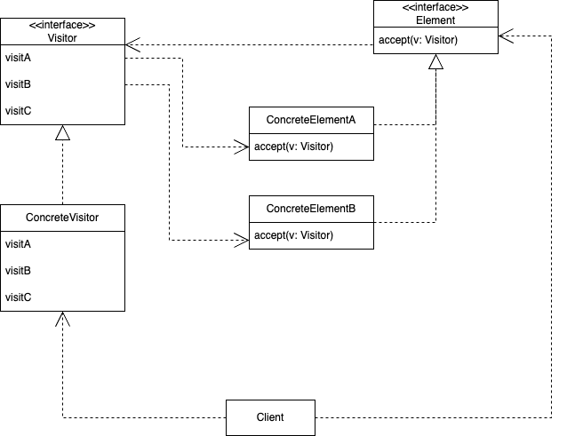

# 비지터 패턴

## 요약

객체와 알고리즘을 분리시키는 디자인 패턴

## 문제

다양한 유형의 객체가 있을 때, 이 객체들에 대해 어떤 작업을 수행하는 요구사항이 추가됐다고 하자.
예를 들어, 어떤 트리 구조의 데이터가 존재하는데, 이 데이터를 XML 형식으로 내보내야 한다고 하자.

데이터 노드의 클래스 메서드로 XML 형식으로 내보내는 코드를 추가하면 다음과 같은 문제가 있다.
- 노드 클래스의 역할은 데이터를 관리하는 것인데, XML로 내보내는 새로운 책임이 추가된다 (단일 책임 원칙 위반)
- 기존에 존재하던 데이터 노드 클래스를 변경해야 하므로 개방 폐쇄 원칙을 위반한다
- 다른 형식으로 내보내는 요구사항이 추가되면 메서드가 또다시 추가돼야 한다

## 해결

Visitor 클래스를 만들고, 여기에 새로 추가될 동작을 정의한다. 처리해야 하는 객체 유형마다 메서드를 생성한다.

```ts
interface ExportVisitor<T = any> {
    exportPage(component: Page): T;
    exportCompoundShape(component: CompoundShape): T;
    exportRectangle(component: Rectangle): T;
    exportCircle(component: Circle): T;
}
```

비지터의 메서드를 올바르게 실행하기 위해서는 작업을 실행할 대상 객체의 클래스를 정확히 알아야 한다. 

이를 위해 *더블 디스패치* 방법을 사용한다. 비지터의 어떤 메서드를 실행할지를 클라이언트 코드가 결정하는 것이 아니라 비지터의 인수로 전달되는 객체가 선택하도록 하는 것이다.

```ts
export class Square extends Component {
    public override accept(visitor: ExportVisitor) {
        return visitor.exportPage(this);
    }
}

const visitor = new XMLExportVisitor();
const components = [new Square(), new Square(), new Circle()]
components.map(component => component.accept(visitor))
```

이 방법을 사용하면 조건문을 사용하지 않고 적절한 메서드를 실행할 수 있게 된다.

결국 기존의 노드 클래스를 변경하긴 했지만, 이는 아주 작은 변경사항이고, 앞으로 새로운 변경사항이 생겼을 때 노드 클래스를 변경하지 않고도 새로운 행동을 추가할 수 있다.

### 장점

- 예상치 못한 새로운 동작이 필요할 때도 쉽게 추가할 수 있다
- 복합체와 함께 사용될 경우, 복합체를 순회하며 누적된 상태를 토대로 작업할 수 있다
- 비지터가 수행하는 기능과 관련된 코드를 한 곳에 모을 수 있다

### 단점

- 복합체가 비지터에게 열려 있을 때, 비지터가 복합체의 요소를 순회하며 복합체를 훼손할 수 있다
- 요소 계층 구조와 비지터 간에 결합이 생겨, 계층 구조가 변경될 때마다 비지터를 변경해야 한다

## 구현



1. 비지터 인터페이스를 생성하고 방문할 구상 클래스를 위한 비지터 메서드 생성
2. 요소 인터페이스에 비지터 객체를 인수로 받는 추상 수락 메서드 추가
3. 모든 구상 요소 클래스에서 수락 메서드 구현
4. 모든 비지터 메서드 구현
5. 클라이언트에서 비지터 객체를 만들고 수락 메서드를 통해 요소에 비지터를 전달


[전체 구현 코드](https://github.com/githru-study/design-patterns/pull/2)

### as-is

```ts
export class CompoundShape extends Component {
    /* ... */

    public exportAsXml(baseNode?: builder.XMLElement): string {
        const result = (baseNode ?? builder.create('CompoundShape'))
        this.children.forEach(x => {
            x.exportAsXml(result.ele(x.getNodeName()))
        })
        return result.toString()
    }
}

export class Circle extends Shape {
    /* ... */

    public exportAsXml(baseNode?: builder.XMLElement): string {
        return (baseNode ?? builder.create(this.getNodeName()))
            .att('centerX', this.position.x)
            .att('centerY', this.position.y)
            .att('radius', this.radius)
            .att('area', Math.floor(Math.pow(this.radius, 2) * Math.PI))
            .toString()
    }
}

export class Rectangle extends Shape {
    /* ... */

    public exportAsXml(baseNode?: builder.XMLElement): string {
        return (baseNode ?? builder.create(this.getNodeName()))
            .att('left', this.position.x)
            .att('top', this.position.y)
            .att('right', this.position.x + this.width)
            .att('bottom', this.position.y + this.height)
            .att('width', this.width)
            .att('height', this.height)
            .att('area', this.width * this.height)
            .toString()
    }
}

// client code
const compoundShape = new CompoundShape();
compoundShape.add(new Rectangle({x: 40, y: 50}, 10, 50));
compoundShape.add(new Circle({x: 80, y: 20}, 20));

const result = compoundShape.exportAsXml()
```

### to-be

```ts
// 기존에 exportAsXml로 구현했던 로직을 Visitor로 이동
export class XmlExportVisitor implements ExportVisitor {
    public exportCompoundShape(compound: CompoundShape) {
        const result = builder.create('CompoundShape')
        let child = ''
        compound.getChildren().forEach(x => child += x.accept(this))
        return result.raw(child).toString()
    }

    public exportCircle(circle: Circle) {
        return builder.create('Circle')
            .att('centerX', circle.getPosition().x)
            .att('centerY', circle.getPosition().y)
            .att('radius', circle.radius)
            .att('area', Math.floor(Math.pow(circle.radius, 2) * Math.PI))
            .toString()
    }

    public exportRectangle(rect: Rectangle) {
        const position = rect.getPosition();
        return builder.create('Rectangle')
            .att('left', position.x)
            .att('top', position.y)
            .att('right', position.x + rect.width)
            .att('bottom', position.y + rect.height)
            .att('width', rect.width)
            .att('height', rect.height)
            .att('area', rect.width * rect.height)
            .toString()
    }
}

export abstract class Component {
    public abstract getChildren(): Set<Component> | null;
    public abstract add(component: Component): void;
    public abstract remove(component: Component): void;
    // 더블 디스패치 - Visitor의 어떤 메서드를 사용할지를 결정
    public abstract accept(visitor: ExportVisitor): void;
}

export class CompoundShape extends Component {
    /* ... */
    
    public override accept(visitor: ExportVisitor) {
        return visitor.exportCompoundShape(this);
    }
}

export class Circle extends Shape {
    /* ... */
 
    public override accept(visitor: ExportVisitor) {
        return visitor.exportCircle(this);
    }
}

export class Rectangle extends Shape {
    /* ... */
   
    public override accept(visitor: ExportVisitor) {
        return visitor.exportRectangle(this);
    }
}

// client code
const visitor = new XmlExportVisitor();

const compoundShape = new CompoundShape();
compoundShape.add(new Rectangle({x: 40, y: 50}, 10, 50));
compoundShape.add(new Circle({x: 80, y: 20}, 20));

const result = compoundShape.accept(visitor)
```

만약에 XML 외에도 JSON 형식으로 내보낼 수 있어야 한다면, 새로운 비지터를 만들어서 쉽게 구현할 수 있다.

```ts
export class JsonExportVisitor implements ExportVisitor<object> {

    exportCompoundShape(component: CompoundShape) {
        const children: object[] = [];
        component.getChildren().forEach(x => children.push(x.accept(this)))
        return { children }
    }

    exportPage(component: Page) {
        const children: object[] = [];
        component.getChildren().forEach(x => children.push(x.accept(this)))
        return { children }
    }

    exportCircle(component: Circle) {
        return {
            center: component.getPosition(),
            radius: component.radius
        }
    }

    exportRectangle(component: Rectangle) {
        return {
            position: component.getPosition(),
            width: component.width,
            height: component.height
        }
    }
}

// client code
const visitor = new JsonExportVisitor();

const compoundShape = new CompoundShape();
compoundShape.add(new Rectangle({x: 40, y: 50}, 10, 50));
compoundShape.add(new Circle({x: 80, y: 20}, 20));

const result = compoundShape.accept(visitor)
```

기존 코드는 전혀 건드리지 않고, JsonExportVisitor만 추가해서 기능을 구현했다!

## 사례

Babel은 자바스크립트 코드를 AST로 변환한 후 순회하기 위해 비지터 패턴을 사용한다. [(공식 문서)](https://github.com/jamiebuilds/babel-handbook/blob/master/translations/en/plugin-handbook.md#visitors)

```ts
// my-babel-plugin.ts
module.exports = function () {
    return {
        visitor: {
            Identifier(path) {
                console.log('identifier');
            },
            BlockStatement(body) {
                console.log('Block')
            },
            ReturnStatement(path, state) {
                console.log('return')
            }
        },
    };
};

// index.ts
function square(n) {
    return n * n;
}

/**
 * 위 코드는 아래와 같은 트리 구조로 변환됨
 - FunctionDeclaration
     - Identifier (id)
     - Identifier (params[0])
     - BlockStatement (body)
         - ReturnStatement (body)
             - BinaryExpression (argument)
                 - Identifier (left)
                 - Identifier (right)
*/

// 출력 결과
identifier // enter 시작
identifier
Block
return
identifier
identifier
```

## 관련 패턴

- 커맨드 패턴과 전략 패턴은 주로 클라이언트 코드가 어떤 동작을 할 지를 결정하게 된다. 이 경우 객체마다 어떤 동작을 할 지에 대해 결정하기 어려워 정교한 추상화를 할 수 없는 반면, 비지터는 방문 동작과 수행 동작을 분리해 이 문제를 해결한다
- 비지터 패턴을 사용해 복합체 패턴 트리 전체를 대상으로 작업을 수행할 수 있다
- 반복자 패턴과 함께 사용해 복잡한 데이터 구조를 순회하며 작업을 실행할 수 있다

## 참고 자료

- [비지터 - Refactoring Guru](https://refactoring.guru/ko/design-patterns/visitor)
- [타입스크립트 디자인 패턴, 빌릭 베인 저](http://www.yes24.com/Product/Goods/38881387)
- [Head First Design Patterns, 에릭 프리먼 등저](http://www.yes24.com/Product/Goods/1778966)
- [Step-by-step guide for writing a custom babel transformation](https://lihautan.com/step-by-step-guide-for-writing-a-babel-transformation/)
