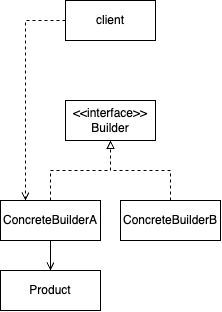
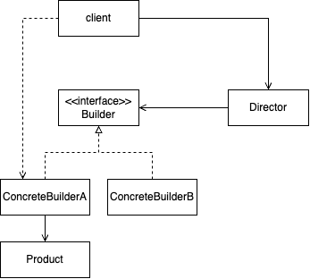

# 빌더 패턴

## 요약

복잡한 객체의 생성 단계를 객체로부터 분리하는 패턴

같은 제작 코드를 사용해 다양한 유형의 객체를 생성할 수 있게 한다

## 문제

아래와 같은 객체를 생성해야 할 경우

- 많은 필드를 가지거나 중첩된 객체를 초기화할 경우
- 객체를 생성하기 위해 아주 많은 매개변수가 필요할 경우

다음과 같은 문제가 생길 수 있다.

- 생성자를 통해 객체를 생성한다면, 생성자의 매개변수가 매우 많아질 것이고 그 중에는 모든 유형의 객체에게 필요하지 않은 매개변수도 있을 수 있다
- 객체의 유형마다 서브클래스를 만들기 어색할 수 있다

이런 문제를 풀기 위해,

- 다양한 객체를 표현할 수 있는 유연한 자료구조가 필요하다
- 객체와 그 객체를 만들기 위한 단계가 섞이지 않게 하고 싶다

## 해결

객체를 만드는 과정을 빌더 객체에 캡슐화한다.

- 빌더 객체를 새로 만들어서, 객체를 생성하는 과정을 메서드로 호출하게 하기
    - 제작에 필요한 단계만 호출하면 됨
    - 빌더 클래스를 여러개 생성해서 빌더 프로세스를 관리 가능
    - 새로운 방식으로 구현해야 한다면 새로운 구상 빌더를 정의하면 됨 (추상 팩토리처럼)
- 필요하다면, 디렉터 클래스에서 제작 단계를 실행하는 순서를 정의
    - 디렉터를 만들지 않고 클라이언트 코드에서 바로 호출할 수도 있음

## 구현



```tsx
interface House {
    door: boolean;
    window: number;
    room: number;
}

interface HouseBuilder {
    setDoor: () => HouseBuilder;
    addWindow: (cnt: number) => HouseBuilder;
    addRoom: (cnt: number) => HouseBuilder;
    getResult: () => House;
}

class ConcreteHouseBuilder implements HouseBuilder {
    private product: House;

    constructor() {
        this.reset();
    }

    public reset() {
        this.product = new House();
        return this;
    }

    addRoom(cnt: number): HouseBuilder {
        this.product.room += cnt;
        return this;
    }

    addWindow(cnt: number): HouseBuilder {
        this.product.window += cnt;
        return this;
    }

    setDoor(): HouseBuilder {
        this.product.door = true;
        return this;
    }

    getResult(): House {
        return this.product;
    }
}

const house = new ConcreteHouseBuilder()
    .reset()
    .setDoor()
    .addRoom(2)
    .addWindow(4)
    .getResult();
```



```tsx
class HouseDirector {
    private builder: HouseBuilder;
    
    public setBuilder(builder: HouseBuilder) {
        this.builder = builder;
    }
    
    public buildHouse() {
        return new ConcreteHouseBuilder()
            .reset()
            .setDoor()
            .addRoom(2)
            .addWindow(4)
            .getResult();
    }
}

const director = new HouseDirector();
director.setBuilder(new HouseBuilder());
const house = director.buildHouse();
```

## 특징

### 장점

- 여러 단계와 다양한 절차로 객체를 만들 수 있음
- 재귀적으로 단계를 호출해서 객체 트리와 같은 복합체를 구성할 수 있음
- 객체를 생성하는 단계 동안 불완전한 제품을 노출하지 않기 때문에 생성 단계를 연기할 수 있음

### 단점

- 필수 속성을 강제할 수 없음
    - 강제해야 하는 경우, 생성자를 통해 객체를 생성하는 게 나을 수 있음
- 빌더 클래스의 구현이 변경될 경우 클라이언트 코드도 변경되어야 할 수 있음

### 다른 패턴과의 관계

- **추상 팩토리**는 관련된 객체의 패밀리를 생성 / **빌더**는 복잡한 객체를 단계별로 생성
- **비지터 패턴**: 자료구조를 순회하면서 객체를 생성할 수 있으나, 비지터는 모델에서 데이터를 pulling 해오는 방식이고 빌더는 정보를 모델에 pushing 하는 방식인 것이 다름

## 적용 사례

### **[xmlbuilder2](https://oozcitak.github.io/xmlbuilder2/)**

체이닝 방식으로 XML 노드에 요소를 추가하거나 속성을 설정

```ts
    public exportRectangle(rect: Rectangle) {
        const position = rect.getPosition();
        // create 메서드로 빌더 인스턴스 생성
        return builder.create('Rectangle')
            .att('left', position.x)
            .att('top', position.y)
            .att('right', position.x + rect.width)
            .att('bottom', position.y + rect.height)
            .att('width', rect.width)
            .att('height', rect.height)
            .att('area', rect.width * rect.height)
            // XML document node를 반환
            .doc()
    }
```

### [Lombok](https://projectlombok.org/features/Builder)

`@Builder` 어노테이션을 사용해 해당 클래스에 빌더 패턴을 적용할 수 있다. `builder()` 메서드로 빌더 인스턴스를 생성하고, `build()` 메서드를 호출해서 객체를 생성한다.

```java
import lombok.Builder;
import lombok.Data;

// 생성자, getter, setter 생성을 위한 어노테이션
@Data
// 빌더 패턴 적용을 위한 어노테이션
@Builder
public class Person {
    private String name;
    private int age;
}

public class Main {
    public static void main(String[] args) {
        Person person = Person.builder()
            .name("John Doe")
            .age(30)
            .build();
    }
}
```

### [Apache Commons Lang - ToStringBuilder](https://commons.apache.org/proper/commons-lang/apidocs/org/apache/commons/lang3/builder/ToStringBuilder.html)

특정 자바 객체의 toString() 메서드를 구현하는 데 사용되는 유틸리티 클래스

복잡한 객체를 생성한다기 보다는 이미 생성된 객체를 기반으로 문자열을 생성하기 때문에 전통적인 빌더 패턴이라고 보기는 어렵다

```java
import org.apache.commons.lang3.builder.ToStringBuilder;
import org.apache.commons.lang3.builder.ToStringStyle;

public class Person {
    private String name;
    private int age;

    // ...

    @Override
    public String toString() {
        return new ToStringBuilder(this, ToStringStyle.SHORT_PREFIX_STYLE)
            .append("name", name)
            .append("age", age)
            .toString();
    }
}

public static void main(String[] args) {
	  Person person = new Person();
	  person.setName("John Doe");
	  person.setAge(30);
	  
	  System.out.println(person.toString()); // Person[name=John Doe,age=30]
}


```
