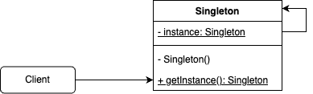

# 싱글턴 패턴

## 요약

특정 클래스의 객체 인스턴스가 하나만 만들어지도록 하고, 어디서든 그 인스턴스에 접근할 수 있게 하는 패턴

## 문제

어떤 객체들은 두 개 이상 있을 경우,

- 프로그램이 정상 동작하지 않을 수 있음 / 결과의 일관성이 보장되지 않을 수 있다
- 자원을 불필요하게 사용할 수 있다

이런 경우, 객체가 하나만 존재하게 강제하는 게 좋다

- 레지스트리 설정
- 스레드 풀 등의 자원 풀
- 공유 리소스에 대한 접근을 제어해야 할 때

## 해결

- 해당 클래스의 생성자를 private으로 설정해서 외부에서 인스턴스를 생성할 수 없게 한다
- 클래스의 인스턴스를 가져오는 정적 메서드를 만들고, 이 메서드에서 인스턴스의 생성과 반환을 관리한다.
- 클래스의 유일한 인스턴스는 정적 private 필드로 관리한다.

## 구조



1. 클래스

```tsx
export class Singleton {
  private static _INSTANCE: Singleton;

  // 필요한 시점에 인스턴스 생성 (Lazy instantiation)
  // static이므로 Singleton 클래스를 통해 어디서든 접근 가능
  public static get instance(): Singleton {
    return Singleton._INSTANCE ?? (Singleton._INSTANCE = new Singleton());
  }

  // 외부에서 생성자에 접근할 수 없음
  private constructor() { /**/ }

  public doSomething() {
    console.log('do something');
  }
}

Singleton.instance.doSomething();
```

2. 클로져

```tsx
type Singleton = {
    foo: string;
    bar: () => void;
}

export const singleton = (() => {
  let instance: Singleton;

  function init(): Singleton {
    return {
      foo: 'hi',
      bar: () => {
        console.log('bar');
      },
    };
  }

  return {
    getInstance: () => {
      if (!instance) {
        instance = init();
      }
      return instance;
    },
  };
})();

test('singleton-closure', () => {
  const instance1 = singleton.getInstance();
  const instance2 = singleton.getInstance();
  expect(instance1).toBe(instance2); // true
});
```

### 멀티스레딩 문제

```java
public static Singleton {
  private static Singleton instance;
  private Singleton() {}

  public static Singleton getInstance() {
    if (instance == null) {
      instance = new Singleton();
    }
    return instance;
  }
}
```

멀티스레딩이 지원되는 환경에서 Lazy instantiation을 사용하는 경우, 여러개의 스레드가 getInstance() 메서드를 함께 실행시켜 인스턴스가 두 개 이상 생성될 가능성이 있다.

1. getInstance를 동기화시킨다

   getInstance가 큰 부담을 주지 않는다면 사용해도 되지만, 동기화는 성능이 100배 정도 저하된다


```java
public static Singleton {
  private static Singleton instance;
  private Singleton() {}

  public static synchronized Singleton getInstance() {
    if (instance == null) {
      instance = new Singleton();
    }
    return instance;
  }
}
```
    
2. 인스턴스를 처음부터 만들어버린다
    
    애플리케이션에서 반드시, 항상 인스턴스를 사용한다면 처음부터 생성해도 괜찮다
    
    클래스 로딩 시 JVM이 인스턴스를 생성하므로, 생성이 완료되기 전까지 어떤 스레드도 인스턴스에 접근 불가능해 멀티스레딩 문제가 해결된다
        
    
```java
public static Singleton {
  private static Singleton instance = new Singleton();
  private Singleton() {}

  public static Singleton getInstance() {
    return instance;
  }
}
```
    
3. DCL(Double-checking locking)으로 동기화되는 부분을 줄인다
    
```java
public static Singleton {
  // volatile -> 변수를 메인 메모리에 저장
  private volatile static Singleton instance;
  private Singleton() {}

  public static Singleton getInstance() {
    if (instance == null) {
      // 블럭 동기화 - 인스턴스가 없는 경우에만 동기화됨
      synchronized (Singleton.class) {
        if (instance == null) {
          instance = new Singleton();
        }
      }
    }
    return instance;
  }
}
```


## 특징

### 장점

- 전역 변수에 비해,
    - 필요한 시점에 인스턴스를 생성하도록 할 수 있다
    - 다른 코드가 인스턴스를 덮어쓰지 못하게 할 수 있다
- 클래스가 하나의 인스턴스만 생성된다는 것을 보장할 수 있다
- 메모리 낭비를 방지할 수 있다

### 단점

- 단일 책임 원칙을 위반한다 - 싱글턴 패턴은 (1) 유일한 인스턴스만 존재하게 하면서 (2) 그 인스턴스에 접근 가능한 전역 지점을 제공하는 두 가지 문제를 한 번에 해결한다.
- 주의! 싱글턴은 제한된 용도로 특수한 상황에서 사용하기 위한 것, 너무 많이 사용하고 있다면 전반적인 디자인을 다시 살펴볼 필요가 있다
- 단위 테스트 시 모킹이 어렵다

## 사례

### [java.lang.Runtime](https://github.com/openjdk/jdk/blob/master/src/java.base/share/classes/java/lang/Runtime.java#LL122C1-L122C1)

Java 애플리케이션이 실행 중인 환경을 나타내는 클래스. 가비지 컬렉션을 실행하거나, 외부 프로세스를 시작하는 등의 작업 수행.

Java 프로그램이 실행되는 환경은 하나이므로, 싱글턴으로 관리함.

```java
public class Runtime {
    private static final Runtime currentRuntime = new Runtime();

    private static Version version;

    public static Runtime getRuntime() {
        return currentRuntime;
    }

    /** Don't let anyone else instantiate this class */
    private Runtime() {}

    // ...
}
```

### [Blockly](https://github.com/google/blockly/blob/4dc2869778c1e24f0112c62e34835d2b15b4875c/core/shortcut_registry.ts#L25)

키보드 숏컷 레지스트리를 위해 싱글턴 사용

```tsx
export class ShortcutRegistry {
  static readonly registry = new ShortcutRegistry();

  /** Registry of all keyboard shortcuts, keyed by name of shortcut. */
  private shortcuts = new Map<string, KeyboardShortcut>();

  /** Map of key codes to an array of shortcut names. */
  private keyMap = new Map<string, string[]>();

  /** Resets the existing ShortcutRegistry singleton. */
  private constructor() {
    this.reset();
  }
```

- [onKeyDown](https://github.com/google/blockly/blob/4dc2869778c1e24f0112c62e34835d2b15b4875c/core/inject.ts#L297)

### [Ruby - Singleton](https://ruby-doc.org/stdlib-2.5.1/libdoc/singleton/rdoc/Singleton.html)

- [참고](https://www.rubyguides.com/2018/05/singleton-pattern-in-ruby/)
- [Ruby on Rails](https://github.com/rails/rails/blob/ef04fbb3b256beececfa44c47c4ec93ac6945e59/actionpack/lib/action_dispatch/http/mime_type.rb#L338)
