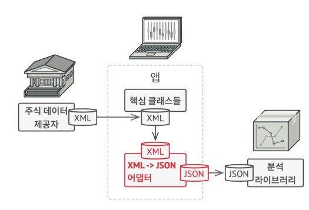

# Adapter 패턴

## 개요

- 한 객체의 인터페이스를 다른 객체가 이해할 수 있도록 변환
  - 기존 애플리케이션에 호환되지 않는 다른 (외부) 인터페이스를 통합


### 해결하고자 하는 문제

- 호환되지 않는 인터페이스 간 협업이 필요할때


### 문제해결 아이디어




- Client : 프로그램의 기존 비즈니스 로직 (=애플리케이션)

- Service(Adaptee) : 인터페이스 호환이 필요한 클래스 (=외부 서비스)

- Adapter : Client ↔ Service 사이를 연결해주는 클래스
  - Service객체를 래핑(wrapping) 하고, 내부적으로 Client객체에서 이해할 수 있는 인터페이스로 변환


### ASIS-TOBE 예제코드
```typescript
/* 애플리케이션 */
class Chart {
  public draw(xml: XML) {
    // ..
  }
}

/* 애플리케이션과 호환되는 외부클래스 */
class StockData {
  public provide(): XML {
    // ..
  }
}

/* 호환되지 않는 외부 클래스 */
class StockAnalysisService {
  public analysis(json: JSON): JSON{
    // ...
  }
}

/* Adapter: 호환되지 않는 외부 클래스를 애플리케이션에 통합 */
class AnalysisChart extends Chart {
  constructor(private adaptee: StockAnalysisService) {}

  public draw(xmlStockData: XML) {
    const jsonStockData: JSON = parseXmlToJson(xmlStockData);

    const jsonAnalysisData: JSON = this.adaptee.analysis(jsonStockData);

    const xmlAnalysisData: XML = parseJsonToXml(jsonAnalysisData);

    return super.draw(xmlAnalysisData);
  }
}
```
```typescript
let chartApp: Chart;
const xmlStockData: XML = StockData.provide();

// 기존 애플리케이션
chartApp = new Chart();
chartApp.draw(xmlStockData);

// 통합된 애플리케이션
const stockAnalysisService = new StockAnalysisService();
chartApp = new AnalysisChart(stockAnalysisService);
chartApp.draw(xmlStockData);
```


### 장점
- 기존 코드를 수정하지 않으면서, 호환되지 않는 인터페이스를 연동할 수 있음


### 단점
- 코드 복잡도가 올라감


---
## 사용사례

### Java

```java
List<String> strings = Arrays.asList("a", "b", "c");
Enumeration<String> enumeration = Collections.enumeration(strings);
ArrayList<String> list = Collections.list(enumeration);
```
- https://github.com/openjdk-mirror/jdk7u-jdk/blob/master/src/share/classes/java/util/Arrays.java#L2826-L2829
- https://github.com/openjdk-mirror/jdk7u-jdk/blob/master/src/share/classes/java/util/Collections.java#L3656-L3668
- https://github.com/openjdk-mirror/jdk7u-jdk/blob/master/src/share/classes/java/util/Collections.java#L3685-L3690


```java
// App Main
public class HelloApplication {
    public static void main(String[] args) {
        DispatcherServlet dispatcherServlet = new DispatcherServlet();
        HandlerAdapter handlerAdapter = new RequestMappingHandlerAdapter();
    }
}

// App Controller
@Controller
public class HelloController {
    @GetMapping("/hello")
    public String hello() {
        return "hi";
    }
}
```
- https://docs.spring.io/spring-framework/docs/3.0.0.M4/spring-framework-reference/html/ch15s02.html


### React + Redux

```typescript
class TodoList extends React.Component {
  // ...
}

function mapStateToProps(state) {
  const { todos } = state
  return {
    todoList: todos,
    todoGroups: Array.from(new Set(todos.map(({ group }) => group))),
  }
}

export default connect(mapStateToProps)(TodoList)
```
- https://github.com/reduxjs/react-redux/blob/master/docs/using-react-redux/connect-extracting-data-with-mapStateToProps.md


---
## 다른 패턴과의 관계
- Adapter vs Decorator vs Facade vs Proxy
  - 넷 모두 Composition과 Delegation를 사용하는 패턴 (그래서 UML을 보면 구조적으로 유사함)
  - 구조적으로는 유사하지만, 집중하고 있는 문제해결(=목적) 이 각각 다름
  - Adapter 는 interface의 전환(convert)이 목적
  - Decorator 는 런타임 기능 추가가 목적
  - Facade 는 복잡한 하위 시스템을 숨기는게 목적
  - Proxy 는 object의 접근제어가 목적

- 참고 : 
  - https://free-strings.blogspot.com/2016/04/adapter-decorator-facade-proxy.html
  - https://javarevisited.blogspot.com/2015/01/adapter-vs-decorator-vs-facade-vs-proxy-pattern-java.html#axzz82KPaypWa


