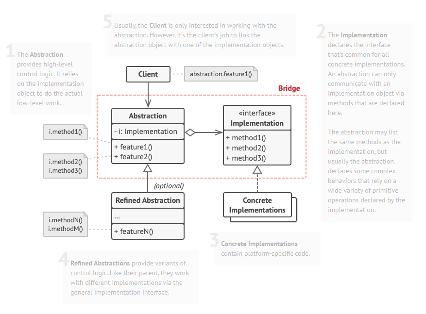

# Bridge 패턴

## 개요

- 밀접하게 관련된 클래스들의 집합을 개별 계층구조(ex. 추상화계층/구현계층)로 나눔
  - 계층을 구분하여 각각 독립적으로 개발할 수 있도록 디자인
  - ex1) 동작들만 모아놓은 계층 / 상태만 모아놓은 계층
  - ex2) 프론트엔드 / 백엔드
  - ex3) GUI / API

### 해결하고자 하는 문제

- 특정 클래스의 여러가지 변형이 발생할 때

- 변형이 발생하는 부분(계층) 을 독립적으로 나누어야 할 필요가 있을 때

- 각각의 독립적인 계층 구조별로 클래스를 확장해야 할 때

- 런타임에 구현을 전환할 수 있어야 할 때

### 문제해결 아이디어



```typescript
/**
 * Bridge Design Pattern
 *
 * Intent: Lets you split a large class or a set of closely related classes into
 * two separate hierarchies—abstraction and implementation—which can be
 * developed independently of each other.
 *
 *               A
 *            /     \                        A         N
 *          Aa      Ab        ===>        /     \     / \
 *         / \     /  \                 Aa(N) Ab(N)  1   2
 *       Aa1 Aa2  Ab1 Ab2
 */
```

- Abstraction 은 이 계층에서의 공통적인 인터페이스를 선언

  - 보통 여기에서 클라이언트에 직접 상호작용하므로, 상위수준의 제어로직 메서드가 정의됨
  - Abstraction 에서는 주로 원시 작업들을 기반으로 더 상위 수준의 작업들을 정의

- Implemetation 은 이 계층에서의 공통적인 인터페이스를 선언

  - Abstraction은 여기에서 정의된 메서드를 통해서만 클라이언트에 기능 제공
  - Implemetation 에서는 주로 원시(primitive) 작업들을 정의

- Concrete-Implemetation 은 플랫폼별 맞춤형 코드를 제공

- Refined-Abstraction 은 제어논리의 변형을 제공(optional)

- 클라이언트는 Abstraction과의 관계에만 관심
  - Abstraction를 통해 Implemetation를 간접적으로 사용
  - 단, Abstraction를 Implemetation중 하나와 연결하는 역할은 수행 (Abstraction에 Implemetation를 주입)

### ASIS-TOBE 예제코드

```typescript
/* Abstraction */
class RemoteControl {
  constructor(protected readonly device: Device) {}

  togglePower() {
    if (this.device.isEnabled()) this.device.disable();
    else this.device.enable();
  }

  volumeDown() {
    this.device.setVolume(this.device.getVolume() - 10);
  }

  volumeUp() {
    this.device.setVolume(this.device.getVolume() + 10);
  }

  channelDown() {
    this.device.setChannel(this.device.getChannel() - 1);
  }

  channelUp() {
    this.device.setChannel(this.device.getChannel() + 1);
  }
}

/* Refined-Abstraction */
class AdvancedRemoteControl extends RemoteControl {
  mute() {
    this.device.setVolume(0);
  }
}

/* Implemetation */
interface Device {
  isEnabled();
  enable();
  disable();
  getVolume();
  setVolume(percent: number);
  getChannel();
  setChannel(channel: number);
}

/* Concrete-Implemetation */
class Tv implements Device {
  //...
}
/* Concrete-Implemetation */
class Radio implements Device {
  //...
}

/* Client */
const tv = new Tv();
const remote1: RemoteControl = new RemoteControl(tv); // Implemetation 주입
remote1.togglePower();

const radio = new Radio();
const remote2: AdvancedRemoteControl = new AdvancedRemoteControl(radio); // Implemetation 주입
remote2.mute();
```

### 장점

- 계층을 분리하여 코드를 관리할 수 있음

  - 추상적인 코드(상위수준의 제어 논리) / 구체적인 코드(제어논리의 세부 구현)

- 다른 계층에 영향을 주지않으면서, 대상 계층을 변경할 수 있음

### 단점

- 코드 복잡도가 올라감
- Implemetation 계층을 나누는 작업이 어려움
- 클라이언트 코드에서 Abstraction로의 의존성이 높아짐

---

## 사용사례

### Java

```java
Class.forName ("org.h2.Driver"); // 런타임에 드라이버(Concrete-Implemetation)를 선택함

try (Connection conn = DriverManager.getConnection ("jdbc:h2:mem:~/test", "sa","")) {
    String sql = "CREATE TABLE  ACCOUNT " +
            "(id INTEGER not NULL, " +
            " email VARCHAR(255), " +
            " password VARCHAR(255), " +
            " PRIMARY KEY ( id ))";

    Statement statement = conn.createStatement();
    statement.execute(sql);
} catch (SQLException e) {
    throw new RuntimeException(e);
}
```

```java
Logger logger = LoggerFactory.getLogger(Slf4jExample.class);  // 특정 로거 구현체(Concrete-Implemetation)를 지정하여 Logger로 가져옴 (cf. Facade)
logger.info("hello logger");
```

### TypeORM

```typescript
import { ConnectionOptions } from "./connection/ConnectionOptions";
import { ConnectionDriver } from "./connection/ConnectionDriver";

export class Connection {
  // ...

  private readonly options: ConnectionOptions;
  private readonly driver: ConnectionDriver;

  constructor(options: ConnectionOptions) {
    this.options = options;
    this.driver = new (this.options.driver as Constructor<ConnectionDriver>)(
      this.options
    );
  }

  // ...
}
```

- https://github.com/typeorm/typeorm/blob/master/src/connection/Connection.ts
- https://github.com/typeorm/typeorm/blob/master/src/data-source/DataSourceOptions.ts

---

## 다른 패턴과의 관계

- 브릿지 패턴은 계층을 나누어 독립적으로 개발할수있는 구조를 제공하는 부분에 초점을 맞춤

  - 어탭터 패턴은 호환되지 않는 클래스들을 서로 잘 작동하도록 연결해주는 부분에 초점을 맞춤

- 브릿지/어댑터/상태/전략 등의 패턴들은 매우 유사한 구조를 가지고 있음 (합성을 통한 작업 위임)

  - but 각 패턴들이 해결하고자 하는 문제가 다름

- 추상팩토리 패턴과 함께 사용하면, Implemetation를 주입하는 부분을 감출수있음
