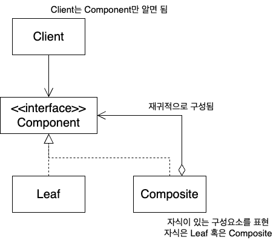

# 복합체 패턴

## 요약

부분-전체 관계를 가진 객체 컬렉션이 있고, 객체들을 모두 똑같은 방식으로 다루기 위해 사용

## 문제 & 해결

포함 관계로 구성된 복잡한 컬렉션이 있을 때, 이 컬렉션을 나타내는 것이 어려울 수 있다. 

## 장점

- 클라이언트의 단순화 - 클라이언트는 사용하는 객체가 Composite인지 Leaf인지 고려하지 않아도 된다
- 복잡한 객체를 유연하게 표현할 수 있다
- 기존 컴포넌트와 유기적으로 동작하는 새로운 컴포넌트를 쉽게 생성할 수 있다

## 단점

- Composite와 Leaf는 모두 Component를 구현해야 하는데, 자신의 역할에 맞지 않는 메서드를 구현해야 할 수도 있다. 이 경우 예외를 던지는 식으로 처리할 수도 있어서 이로 인한 런타임 에러가 발생할 수 있다.
- Component는 Composite와 Leaf 두 가지 역할을 하게 되므로 단일 역할 원칙을 어긴다.
    - (대신, 클라이언트는 Composite와 Leaf를 같은 방식으로 다룰 수 있게 된다 - 투명성 확보)

## 구조



- **Component**: 컴포지트 객체의 기본 동작 구현, 인터페이스 정의
- **Composite**: 자식 컴포넌트 저장, 자체 동작과 작업 구현
- **Leaf**: 원시 컴포넌트 동작 정의

## 예시

```tsx
abstract class Component {
    protected parent!: Component | null;

    public setParent(parent: Component | null) {
        this.parent = parent;
    }

    public getParent(): Component | null {
        return this.parent;
    }

    public abstract add(component: Component): void;
    public abstract remove(component: Component): void;

    public isComposite(): boolean {
        return this instanceof Composite;
    }
}

export class Composite extends Component {
    private children: Set<Component> = new Set<Component>();

    public override add(component: Component) {
        this.children.add(component);
    }

    public override remove(component: Component) {
        this.children.delete(component);
    }
}

export class Leaf extends Component {
    public override add(component: Component) {
        throw new Error('Leaf에서 컴포넌트를 추가할 수 없음');
    }

    public override remove(component: Component) {
        throw new Error('Leaf에서 컴포넌트를 삭제할 수 없음');
    }
}
```

## 사례

```tsx
class Parent extends React.Component {
  render() {
    return (
      <div>
        <h1>Parent Component</h1>
        <Child1 />
        <Child2 />
      </div>
    );
  }
}

class Child1 extends React.Component {
  render() {
    return <div>Child1 Component</div>;
  }
}

class Child2 extends React.Component {
  render() {
    return <div>Child2 Component</div>;
  }
}
```

## 다른 패턴 참고

- 빌더를 사용해 복합체 패턴 트리 생성
- 책임 연쇄 패턴으로 트리의 root 까지 요청을 전달
- 이터레이터를 사용해 트리를 순회
- 비지터 패턴을 사용해 트리 전체를 대상으로 작업 수행
- 프로토타입을 사용해서 복잡한 구조를 다시 건축하지 않고 복제해서 사용 가능
