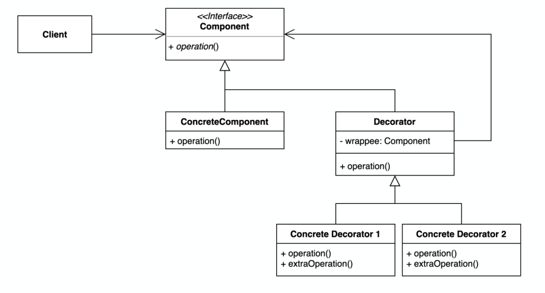

# Decorator 패턴

## 개요

### 해결하고자 하는 문제

- 클래스 전체에 새로운 기능을 추가할 필요는 없지만, 개별적인 객체에 대한 새로운 책임 추가가 필요할떄
- 객체에 동적으로 책임을 추가할떄


### 문제해결 아이디어



- 특정 구성요소를 감싸고, 그 구성요소로 전달되는 요청을 중간에 접근할 수 있는 구조
  - Component : Wrapping할 대상 객체의 인터페이스
  - ConcreteComponent : 실제로 Wrapping할 객체 (원본 operation)
  - Decorator : Component인터페이스를 만족하면서, Wrapping한 Component객체의 참조를 관리
  - ConcreteDecorator : 새롭게 추가할 책임이 구현되는곳 (추가된 operation)

- 상속이 아닌 위임을 사용하여 부가기능을 추가
  - 기존 코드를 변경하지 않고 기능을 추가할 수 있음
  - 컴파일타임이 아니라 런타임에 동적으로 기능을 변경할 수 있음

- 데코레이터와 원본컴보넌트 간의 투명성(=동일 인터페이스)
  - 인터페이스의 투명성으로 인해 데코레이터의 중첩이 가능 (책임 추가 제한없음)
  - 호스트코드 쪽에서는 데코레이터를 인식할 수 없음


### ASIS-TOBE 예제코드

```typescript
class UserService {
  doSomething(arg: string) {
    const result = 11; // TODO complex calculation
    return result;
  }

  doSomething1(arg: string) {
    // logging
    console.log("arg: " + arg);

    // check auth
    if(!isUserAuthenticated()) {
        throw new Error("User is not authenticated");
    }

    // caching
    if(cache.has(arg)) {
      return cache.get(arg);
    }

    const result = 11; // TODO complex calculation

    // caching
    cache.set(arg, result);
    
    // logging
    console.log("result: ", result);
    return result;
  }

  doSomething2(arg: string) {
    // logging
    console.log("arg: ", arg);

    // check auth
    if(!isUserAuthenticated()) {
        throw new Error("User is not authenticated");
    }

    const result = 22; // TODO complex calculation
    
    // logging
    console.log("result: ", result);
    return result;
  }

  doSomething3(arg: string) {
    // logging
    console.log("arg: ", arg);

    // caching
    if(cache.has(arg)) {
      return cache.get(arg);
    }

    const result = 33; // TODO complex calculation
    
    // caching
    cache.set(arg, result);

    // logging
    console.log("result: " + result);
    return result;
  }

  // ...
}
```
```typescript
class UserService {}
class UserServiceWithLogging {}
class UserServiceWithLoggingAndCaching {}
class UserServiceWithLoggingAndAuthencating {}
class UserServiceWithCaching {}
class UserServiceWithCachingAndAuthencating {}
// ...
```
- 로깅, 캐싱, 인증의 조합 수 만큼 서브클래스를 생성..?
- 공통 로직을 횡단관심사로 추출 가능..!


```typescript
interface Service {
  doSomething1(arg: string)
  doSomething2(arg: string)
  doSomething3(arg: string)
}

class UserService implements Service {
  doSomething1(arg: string) {
    const result = 11; // TODO complex calculation
    return result;
  }
  doSomething2(arg: string)
  doSomething3(arg: string)
}

class Decorator implements Service {
  construtor(protected wrappee: Service) {}
  doSomething1(arg: string)
  doSomething2(arg: string)
  doSomething3(arg: string)
}

class LogDecorator extends Decorator {
  doSomething1(arg: string) {
    // logging
    console.log("arg: ", arg);

    const result = this.wrappee.doSometing1()

    // logging
    console.log("result: " + result);

    return result
  }
  doSomething2(arg: string)
  doSomething3(arg: string)
}

class CacheDecorator extends Decorator {
  doSomething1(arg: string) {
    // caching
    if(cache.has(arg)) {
      return cache.get(arg);
    }

    const result = this.wrappee.doSometing1()

    // caching
    cache.set(arg, result);

    return result
  }
  doSomething2(arg: string)
  doSomething3(arg: string)
}

class AuthDecorator extends Decorator {
  doSomething1(arg: string) {
    // check auth
    if(!isUserAuthenticated()) {
        throw new Error("User is not authenticated");
    }

    return this.wrappee.doSometing1()
  }
  doSomething2(arg: string)
  doSomething3(arg: string)
}

class Client {
  main() {
    const userService: Service = new UserService()
    userService.doSomething1() // normal

    let wrappedUserService = new LogDecorator(userService)
    wrappedUserService.doSomething1() // logging

    wrappedUserService = new LogDecorator(new CacheDecorator(userService))
    wrappedUserService.doSomething1() // logging + caching

    wrappedUserService = new LogDecorator(new AuthDecorator(userService))
    wrappedUserService.doSomething1() // logging + check auth

    wrappedUserService = new LogDecorator(new CacheDecorator(new AuthDecorator(userService)))
    wrappedUserService.doSomething1() // logging + caching + check auth
    
    // ...
  }
}
```
- ConcreteComponent(여기에서는 UserService) 는 본연의 기능만 구현하면 됨
  - 로깅, 캐싱, 인증은 데코레이터에서 구현하고, 그 데코레이터를 본래 기능 앞뒤로 Wrapping해서 사용하는 방식
- 상속으로 구현했으면 3!(공통로직 조합 경우의 수) 만큼 서브클래스 생성했을 수도 있음
- 데코레이터로 정의하면, 공통로직 종류만큼만 생성하면됨
- configuration 주입을 통해 동적으로 조합 객체를 생성할수도있음


```typescript
function log(target: any, propertyKey: string, descriptor: PropertyDescriptor) {
  // keep a reference to the original function
  const originalValue = descriptor.value;

  // Replace the original function with a wrapper
  descriptor.value = function (...args: any[]) {
    console.log("arg: ", ...args);

    // Call the original function
    const result = originalValue.apply(this, args);

    console.log("result: ", result);
    return result;
  }
}

function cache(target: any, propertyKey: string, descriptor: PropertyDescriptor) {
  const originalValue = descriptor.value;
  const cache = new Map<any, any>();

  descriptor.value = function (...args: any[]) {
    if (cache.has(arg)) {
      return cache.get(arg);
    }

    // call the original function
    const result = originalValue.apply(this, [arg]);

    // cache the result
    cache.set(arg, result);
    return result;
  }
}

function authorize(target: any, propertyKey: string, descriptor: PropertyDescriptor) {
  const originalValue = descriptor.value;
  const cache = new Map<any, any>();

  descriptor.value = function (...args: any[]) {
    if (cache.has(arg)) {
      return cache.get(arg);
    }

    // call the original function
    const result = originalValue.apply(this, [arg]);

    // cache the result
    cache.set(arg, result);
    return result;
  }
}

class Service {
  @log
  @cache
  @authorize
  doSomething(arg: string) {
    const result = 11; // TODO complex calculation
    return result;
  }

  @log
  @authorize
  doSomething2(arg: string) {
    const result = 22; // TODO complex calculation
    return result;
  }

  @log
  @cache
  doSomething2(arg: string) {
    const result = 33; // TODO complex calculation
    return result;
  }
}
```
- reflection을 통해 좀 더 간결하게 사용할 수 있음


### 장점
- 상속보다 더 유연하게 클래스 설계 가능
  - 클래스 계층구조의 복잡성 크게 감소
  - 상위쪽 클래스에 많은 기능이 누적되는 상황을 피할수있음

### 단점
- 작은 규모의 객체들이 많이 생성되는 구조이므로, 각 객체들을 모두 이해하고 수정하는 과정이 복잡해질수있음
- 각 데코레이터의 Wrapping 순서에 조심해야함

### 유즈케이스
- 다른 객체에 영향을 주지 않고, 개개의 객체에 새로운 책임을 추가하기 위해 사용함
- 서브클래스를 계속 만드는게 실질적이지 못할때 사용함
  - 너무 많은 수의 독립된 확장이 필요한 경우, 모든 경우의 수를 지원하려면 상속 클래스가 폭발적으로 증가
- 제거될 수 있는 책임에 대해 사용함


---
## 사용사례

### Java

```java
// io
try(InputStream is = new FileInputStream("input.txt");
    InputStreamReader isr = new InputStreamReader(is);
    BufferedReader reader = new BufferedReader(isr)) {
    while(reader.ready()) {  // ready() 가 BufferedReader → InputStreamReader → Reader → StreamDecoder 으로 전달됨
        System.out.println(reader.readLine());
    }
} catch (IOException e) {
    throw new RuntimeException(e);
}
```
- https://github.com/openjdk-mirror/jdk7u-jdk/blob/master/src/share/classes/java/io/BufferedReader.java
- https://github.com/openjdk-mirror/jdk7u-jdk/blob/master/src/share/classes/java/io/InputStreamReader.java
- https://github.com/openjdk-mirror/jdk7u-jdk/blob/master/src/share/classes/java/io/Reader.java
- https://github.com/frohoff/jdk8u-jdk/blob/master/src/share/classes/sun/nio/cs/StreamDecoder.java


```java
// collections가 제공하는 데코레이터 메소드
ArrayList list = new ArrayList<>();
list.add(new Book());  // ok

List books = Collections.checkedList(list, Book.class);
// books.add(new Item());  // error..!  (CheckedList 의 add() 에서 예외 발생)
```
- https://github.com/openjdk-mirror/jdk7u-jdk/blob/master/src/share/classes/java/util/Collections.java#L2493
- https://github.com/openjdk-mirror/jdk7u-jdk/blob/master/src/share/classes/java/util/Collections.java#L2568
- https://github.com/openjdk-mirror/jdk7u-jdk/blob/master/src/share/classes/java/util/Collections.java


```java
// 서블릿 요청 또는 응답 랩퍼
HttpServletRequestWrapper requestWrapper;
HttpServletResponseWrapper responseWrapper;
```
- https://github.com/javaee/servlet-spec/blob/master/src/main/java/javax/servlet/http/HttpServletRequestWrapper.java
- https://github.com/javaee/servlet-spec/blob/master/src/main/java/javax/servlet/http/HttpServletResponseWrapper.java


### Spring Framework

```java
public class ServerHttpRequestDecorator implements ServerHttpRequest {
	private final ServerHttpRequest delegate;

	public ServerHttpRequestDecorator(ServerHttpRequest delegate) {
		Assert.notNull(delegate, "Delegate is required");
		this.delegate = delegate;
	}

	public ServerHttpRequest getDelegate() {
		return this.delegate;
	}

	// ServerHttpRequest delegation methods...

	@Override
	public String getId() { return getDelegate().getId(); }

	@Override
	public HttpMethod getMethod() { return getDelegate().getMethod(); }

	@Override
	public URI getURI() { return getDelegate().getURI(); }

	// ...
}
```
- https://github.com/spring-projects/spring-framework/blob/main/spring-web/src/main/java/org/springframework/http/server/reactive/ServerHttpRequestDecorator.java
- https://github.com/spring-projects/spring-framework/blob/main/spring-web/src/main/java/org/springframework/http/server/ServerHttpRequest.java


```java
@Component
public class LogFilter implements WebFilter {
  private static final Logger LOGGER = LoggerFactory.getLogger(LogFilter.class);

  @Override
  public Mono<Void> filter(ServerWebExchange exchange, WebFilterChain chain) {
      long startTime = System.currentTimeMillis();
      String path = exchange.getRequest().getURI().getPath();
      LOGGER.info("Serving '{}'", path);

      return chain.filter(exchange).doAfterTerminate(() -> {
                  exchange.getResponse().getHeaders().entrySet().forEach(e ->
                          LOGGER.info("Response header '{}': {}", e.getKey(), e.getValue()));

                  LOGGER.info("Served '{}' as {} in {} msec",
                          path,
                          exchange.getResponse().getStatusCode(),
                          System.currentTimeMillis() - startTime);
              }
      );
  }
}
```
- https://github.com/spring-projects/spring-framework/blob/main/spring-web/src/main/java/org/springframework/web/server/WebFilter.java
- https://github.com/opentracing-contrib/java-spring-web/blob/master/opentracing-spring-web/src/main/java/io/opentracing/contrib/spring/web/webfilter/TracingWebFilter.java

※ spring application.properties 에 정의된 설정 기반 → Bean 을 동적으로 Wrapping 해서 생성 가능


### NestJS

```typescript
export function Injectable(options?: InjectableOptions): ClassDecorator {
  return (target: object) => {
    Reflect.defineMetadata(INJECTABLE_WATERMARK, true, target);
    Reflect.defineMetadata(SCOPE_OPTIONS_METADATA, options, target);
  };
}
```
- https://github.com/nestjs/nest/blob/master/packages/common/decorators/core/injectable.decorator.ts
  - https://github.com/nestjs/nest/blob/master/packages/common/test/decorators/injectable.decorator.spec.ts
- https://github.com/nestjs/nest/blob/master/packages/common/decorators/core/set-metadata.decorator.ts
  - https://github.com/nestjs/nest/blob/master/packages/common/test/decorators/set-metadata.decorator.spec.ts

```typescript
export function Inject<T = any>(token?: T) {
  return (target: object, key: string | symbol | undefined, index?: number) => {
    const type = token || Reflect.getMetadata('design:type', target, key);

    if (!isUndefined(index)) {
      let dependencies =
        Reflect.getMetadata(SELF_DECLARED_DEPS_METADATA, target) || [];

      dependencies = [...dependencies, { index, param: type }];
      Reflect.defineMetadata(SELF_DECLARED_DEPS_METADATA, dependencies, target);
      return;
    }
    let properties =
      Reflect.getMetadata(PROPERTY_DEPS_METADATA, target.constructor) || [];

    properties = [...properties, { key, type }];
    Reflect.defineMetadata(
      PROPERTY_DEPS_METADATA,
      properties,
      target.constructor,
    );
  };
}
```
- https://github.com/nestjs/nest/blob/master/packages/common/decorators/core/inject.decorator.ts
  - https://github.com/nestjs/nest/blob/master/packages/common/test/decorators/inject.decorator.spec.ts


### ReduxJS/react-redux

```javascript
import React from 'react'
import { connect } from 'react-redux'
import * as actions from '../modules';

const mapStateToProps = (state) => {
  return { users: state.users }; 
}

const mapDispatchToProps = (dispatch) => {
  return {
    doSomething() {
      dispatch(actions.doSomething()) 
    }
  }
}

@connect(mapStateToProps, mapDispatchToProps)
export default class MyComponent extends React.Component {
  // ...

  render () {
    const { doSomething } = this.props
    return <Counter onClick={doSomething} />
  }
}
```
- https://github.com/reduxjs/react-redux/blob/master/src/components/connect.tsx#L442


### ReactJS (custom decorator)

```javascript
/* app/decorators/connect.js */
const connect = (Component, store) => {
  return class Connect extends React.Component {
    constructor(props) {
      super(props);

      this.storeChanged = this.storeChanged.bind(this);
      this.state = store.getState();

      store.listen(this.storeChanged);
    }

    componentWillUnmount() {
      store.unlisten(this.storeChanged);
    }

    storeChanged() {
      this.setState(store.getState());
    }
    
    render() {
      return <React.Component {...this.props} {...this.state} />;
    }
  };
};

export default (store) => { // store를 주입받고
  return (target) => connect(target, store); // store와 타겟 컴포넌트를 연결
};

/* app/components/App.jsx */
@connect(NoteStore)
export default class App extends React.Component {
  render() {
    const notes = this.props.notes;
    // ...
  }

  // ...
}
```
- https://survivejs.com/react/appendices/understanding-decorators/


---
## 고려사항

### Component 클래스는 가벼운 무게를 유지

- ConcreteComponent와 Decoratoer 모두 Component 인터페이스를 만족해야함
- Component는 연산에 해당하는 부분만 정의하고, 무언가 저장하는 부분은 정의하면 안됨 (=가벼워야함)
  - 데이터를 저장을 정의하는 것은 서브클래스(ConcreteComponent)에서 해야할 일임
  - 상위클래스(Component)서 너무 많은 서비스를 정의하면, 그를 상속받는 Decoratoer도 무거워지게됨


### Decoratoer 인터페이스 생략

- Decoratoer들이 정의해야할 책임이 한가지 밖에 없을때,  
  Decoratoer가 Component참조로 요청을 전달하는 책임을 ConcreteComponent와 합칠 수 있음


---
## 관련된 패턴

### 어탭터(Adapter)
- 데코레이터패턴은 객체의 책임/행동을 변화시키고, 어탭터패턴은 인터페이스를 변경시킴

### 전략(Strategy)
- 데코레이터패턴은 객체의 겉모양을 변경하고, 전략패턴은 객체의 내부를 변화시킴

### 복합체(Composit)
- 데코레이터패턴은 하나의 Component만을 가지는 복합체로 볼 수 있음


---
## 참고 자료
- https://medium.com/google-developers/exploring-es7-decorators-76ecb65fb841
- https://www.typescriptlang.org/docs/handbook/decorators.html
- https://dparkjm.com/typescript-decorators
- https://rbuckton.github.io/reflect-metadata/
- https://darrengwon.tistory.com/1128


