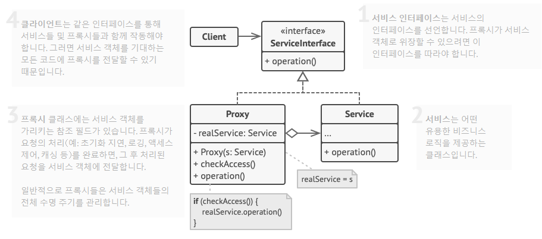
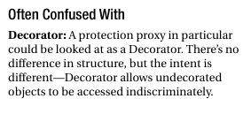
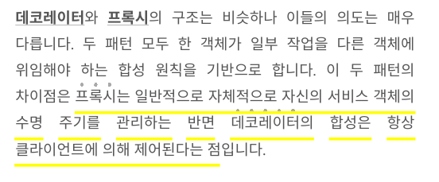

# Proxy 패턴

## 개요

- 다른 객체에 대한 대리(substitute) 또는 자리표시자(placeholder) 를 제공
- 원래 객체에 대한 접근을 제어  
  - 요청이 원래 객체에 전달되기 전/후에 무언가를 수행할 수 있도록 구성


### 해결하고자 하는 문제

- 로직의 전/후에 무언가를 실행해야하는 경우
  - 객체를 필요할 때만 생성해야하는 경우 (지연된 초기화 - Virtual Proxy)
  - 특정 클라이언트만 객체를 사용할수있도록 해야하는 경우 (접근제어 - Protection Proxy)
  - 원격 서비스의 로컬 실행 (Remote Proxy)
  - 각 요청들의 로깅 (Logging Proxy)
  - 요청 결과의 캐싱 (Caching Proxy)
  - 참조 클라이언트가 없는 경우에 객체 해제 (Smart Reference)


### 문제해결 아이디어



- Service : 비즈니스 로직 구현체
  - 특정 Operation을 인터페이스로 가지고있음

- Proxy : 
  - Service인터페이스를 구현 (타겟 Operation을 구현)
  - 실제 서비스 객체에 대한 참조를 가지고있음
  - 프록시의 처리(ex. 지연 초기화, 로깅, 접근제어, 캐싱 등) 를 완료한 뒤, 서비스 객체에 요청을 전달(pass)


### ASIS-TOBE 예제코드

(Virtual Proxy)
```typescript
// 이미지 인터페이스
interface Image {
  display(): void;
}

// 실제 이미지 클래스
class ImageImpl implements Image {
  private readonly filename: string;

  constructor(filename: string) {
    this.filename = filename;
    this.loadImageFromDisk();  // 객체생성과 동시에 이미지를 로딩
  }

  private loadImageFromDisk(): void {
    // ...
    console.log(`Loading image: ${this.filename}`);
  }

  display(): void {
    // ...
    console.log(`Displaying image: ${this.filename}`);
  }
}

// 가상 프록시
class ImageProxy implements Image {
  private originImage: Image | null = null;

  constructor(private readonly filename: string) {}

  display(): void {
    if (!this.originImage) {
      this.originImage = new ImageImpl(this.filename);  // 출력시점에 실제 이미지를 로딩
    }
    this.originImage.display();
  }
}

// 클라이언트
function run() {
  const image1: Image = new ImageProxy("image1.jpg");
  const image2: Image = new ImageProxy("image2.jpg");

  image1.display(); // 이미지1을 로드하고 표시
  image2.display(); // 이미지2를 로드하고 표시
  image1.display(); // 이미지1을 로드하지 않고 표시 (생성되어있는 originImage 재사용)
}
```

(Protection Proxy)
```typescript
// 원격 서비스 인터페이스
interface RemoteService {
  getData();
}

// 원격 서비스 구현
class RemoteServiceImpl implements RemoteService {
  getData() {
    // ...
    console.log("data");
  }
}

// 보호 프록시
class ProtectionProxy implements RemoteService {
  private remoteService: RemoteServiceImpl | null = null;
  private isAuthenticated: boolean = false;

  private authenticate(): void {
    // ...
    this.isAuthenticated = true;
    console.log("authenticate ok");
  }

  private checkAuthentication(): boolean {
    if (!this.isAuthenticated) {
      console.log("not authenticated");
    }
    return this.isAuthenticated;
  }

  getData() {
    if (!this.remoteService) {
      this.remoteService = new RemoteServiceImpl();
    }

    if (this.checkAuthentication()) {  // 인증여부 확인하고
      this.remoteService.getData();  // 원래객체 오퍼레이션 실행
    }
  }
}

// 클라이언트
function run() {
  const proxy: RemoteService = new ProtectionProxy();
  proxy.getData(); // 출력: not authenticated
  proxy.authenticate(); // 출력: authenticate ok
  proxy.getData(); // 출력: data
}
```


(Smart Reference)
```typescript
// 원격 서비스 인터페이스
interface OriginService {
  getData();
}

// 원격 서비스 구현
class OriginServiceImpl implements OriginService {
  getData() {
    // ...
    console.log("Fetching data...");
  }
}

// 스마트 레퍼런스 프록시
class SmartReferenceProxy implements OriginService {
  private originService: OriginService | null = null;
  private referenceCount: number = 0;

  getData() {
    if (!this.originService) {
      this.originService = new OriginServiceImpl();  // 지연 초기화
    }

    this.referenceCount += 1;
    console.log(`Reference count: ${this.referenceCount}`);

    this.originService.getData();  // 원본객체 오퍼레이션 실행
  }

  release(): void {
    this.referenceCount -= 1;

    if (this.referenceCount === 0) {  // 참조 카운트가 0이 되면 원격 객체를 해제
      this.originService = null;
      console.log("Remote service released.");
    }

    console.log(`Reference count: ${this.referenceCount}`);
  }
}

// 클라이언트
function run() {
  const proxy: OriginService = new SmartReferenceProxy();

  proxy.getData(); // 출력: Fetching data...  Reference count: 1 
  proxy.getData(); // 출력: Fetching data...  Reference count: 2 

  proxy.release(); // 출력: Reference count: 1
  proxy.release(); // 출력: Remote service released. Reference count: 0 
}
```


### 장점
- 지연된 초기화, 접근제어, 원격 프록시, 로깅 프록시, 캐싱 프록시, 스마트 참조
  - 객체가 다른 주소공간에 존재한다는 사실을 숨길 수 있음 (Remote Proxy)
  - 객체가 실제로 사용될때 생성하는 등의 처리 최적화를 할 수 있음 (Virtual Proxy)
  - 클라이언트가 객체에 접근할때마다 객체에 대한 생성/삭제를 관리할 수 있음 (Protection Proxy, Smart Reference)

- 서비스나 클라이언트 코드를 변경하지 않고도 새 프록시들을 도입할 수 있음 (OCP)


### 단점
- 코드가 복잡해질 수 있음
- 서비스의 응답이 늦어질 수 있음


---
## 사용사례

### Java

```java
/**
 *     InvocationHandler handler = new MyInvocationHandler(...);
 *     Foo f = (Foo) Proxy.newProxyInstance(Foo.class.getClassLoader(),
 *                                          new Class<?>[] { Foo.class },
 *                                          handler);
 */
FooService foo = Proxy.newProxyInstance(FooService.class.getClassLoader(),
                                        new Class[] { FooService.class },
                                        (proxy, method, args) -> {
                                            System.out.println("logging start..");
                                            method.invoke(target, args);
                                            System.out.println("logging end..");
                                            return null;
                                        });
```
- https://github.com/openjdk/jdk/blob/master/src/java.base/share/classes/java/lang/reflect/Proxy.java#L1039-L1061


### OpenTelemetry (Nodejs)

```typescript
import { NodeSDK } from '@opentelemetry/sdk-node';
import { ConsoleSpanExporter } from '@opentelemetry/sdk-trace-node';
// import { getNodeAutoInstrumentations } from '@opentelemetry/auto-instrumentations-node';
import { PeriodicExportingMetricReader, ConsoleMetricExporter } from '@opentelemetry/sdk-metrics';

const sdk = new NodeSDK({
  traceExporter: new ConsoleSpanExporter(),
  metricReader: new PeriodicExportingMetricReader({
    exporter: new ConsoleMetricExporter()
  }),
  instrumentations: [getNodeAutoInstrumentations()]
});

sdk.start();

// Instrumentations 정의
function getNodeAutoInstrumentations(
  inputConfigs: InstrumentationConfigMap = {}
): Instrumentation[] {
  for (const name of Object.keys(inputConfigs)) {  // 유명한 package들을 자동으로 불러와서 metric에 등록
    if (!Object.prototype.hasOwnProperty.call(InstrumentationMap, name)) {
      diag.error(`"${name}" not found`);
      continue;
    }
  }
  ...
}
```
- https://opentelemetry.io/docs/


```typescript
// .yarn/__virtual__/@opentelemetry-auto-instrumentations-node-virtual-17a11738c2/0/cache/@opentelemetry-auto-instrumentations-node-npm-0.36.0-4efc8ff5b8-37e6606d05.zip/node_modules/@opentelemetry/auto-instrumentations-node/src/utils.ts

const InstrumentationMap = {
  '@opentelemetry/instrumentation-amqplib': AmqplibInstrumentation,
  '@opentelemetry/instrumentation-aws-lambda': AwsLambdaInstrumentation,
  '@opentelemetry/instrumentation-aws-sdk': AwsInstrumentation,
  '@opentelemetry/instrumentation-bunyan': BunyanInstrumentation,
  '@opentelemetry/instrumentation-cassandra-driver':
    CassandraDriverInstrumentation,
  '@opentelemetry/instrumentation-connect': ConnectInstrumentation,
  '@opentelemetry/instrumentation-dataloader': DataloaderInstrumentation,
  '@opentelemetry/instrumentation-dns': DnsInstrumentation,
  '@opentelemetry/instrumentation-express': ExpressInstrumentation,
  '@opentelemetry/instrumentation-fastify': FastifyInstrumentation,
  '@opentelemetry/instrumentation-fs': FsInstrumentation,
  '@opentelemetry/instrumentation-generic-pool': GenericPoolInstrumentation,
  '@opentelemetry/instrumentation-graphql': GraphQLInstrumentation,
  '@opentelemetry/instrumentation-grpc': GrpcInstrumentation,
  '@opentelemetry/instrumentation-hapi': HapiInstrumentation,
  '@opentelemetry/instrumentation-http': HttpInstrumentation,
  '@opentelemetry/instrumentation-ioredis': IORedisInstrumentation,
  '@opentelemetry/instrumentation-knex': KnexInstrumentation,
  '@opentelemetry/instrumentation-koa': KoaInstrumentation,
  '@opentelemetry/instrumentation-lru-memoizer': LruMemoizerInstrumentation,
  '@opentelemetry/instrumentation-memcached': MemcachedInstrumentation,
  '@opentelemetry/instrumentation-mongodb': MongoDBInstrumentation,
  '@opentelemetry/instrumentation-mongoose': MongooseInstrumentation,
  '@opentelemetry/instrumentation-mysql2': MySQL2Instrumentation,
  '@opentelemetry/instrumentation-mysql': MySQLInstrumentation,
  '@opentelemetry/instrumentation-nestjs-core': NestInstrumentation,
  '@opentelemetry/instrumentation-net': NetInstrumentation,
  '@opentelemetry/instrumentation-pg': PgInstrumentation,
  '@opentelemetry/instrumentation-pino': PinoInstrumentation,
  '@opentelemetry/instrumentation-redis': RedisInstrumentationV2,
  '@opentelemetry/instrumentation-redis-4': RedisInstrumentationV4,
  '@opentelemetry/instrumentation-restify': RestifyInstrumentation,
  '@opentelemetry/instrumentation-router': RouterInstrumentation,
  '@opentelemetry/instrumentation-socket.io': SocketIoInstrumentation,
  '@opentelemetry/instrumentation-tedious': TediousInstrumentation,
  '@opentelemetry/instrumentation-winston': WinstonInstrumentation,
};
```
- https://github.com/open-telemetry/opentelemetry-js/blob/main/experimental/packages/opentelemetry-instrumentation-http/src/http.ts#L113-L155
  - http 모듈을 재정의하는 코드 (HttpInstrumentation)

- https://github.com/open-telemetry/opentelemetry-js/blob/main/experimental/packages/opentelemetry-instrumentation/src/platform/node/instrumentationNodeModuleDefinition.ts#L22-L35
  - node module 재정의 클래스

- https://github.com/open-telemetry/opentelemetry-js/blob/main/experimental/packages/opentelemetry-instrumentation/src/platform/node/types.ts#L35-L59
  - node module 재정의 클래스의 인터페이스

- https://github.com/open-telemetry/opentelemetry-js/blob/main/experimental/packages/opentelemetry-instrumentation/src/autoLoader.ts#L31-L45
  - HttpInstrumentation 를 tracer 에 등록

- https://github.com/open-telemetry/opentelemetry-js/blob/main/experimental/packages/opentelemetry-instrumentation/src/autoLoaderUtils.ts#L52-L73
  - HttpInstrumentation 를 tracer 에 등록하는 실제 구현체

- https://github.com/open-telemetry/opentelemetry-js/blob/0f178d1e2e9b3aed81789820944452c153543198/api/src/trace/tracer_provider.ts#L23-L37
  - tracer provider 인터페이스

- https://github.com/open-telemetry/opentelemetry-js/blob/main/api/src/api/trace.ts#L81-L90
  - getTracerProvider

- https://github.com/open-telemetry/opentelemetry-js/blob/main/api/src/trace/ProxyTracerProvider.ts#L33-L64
  - ProxyTracerProvider 

- https://github.com/open-telemetry/opentelemetry-js/blob/main/experimental/packages/opentelemetry-instrumentation/src/platform/node/instrumentation.ts#L173-L219
  - onRequire

- https://github.com/open-telemetry/opentelemetry-js/blob/main/experimental/packages/opentelemetry-instrumentation/src/platform/node/RequireInTheMiddleSingleton.ts#L54-L86
  - RequireInTheMiddleSingleton

- https://github.com/open-telemetry/opentelemetry-js/blob/main/experimental/packages/opentelemetry-instrumentation/src/platform/node/instrumentation.ts#L37-L45
  - InstrumentationBase 에서 RequireInTheMiddleSingleton init


---
## 고려사항

### 기록 시점 복사 (copy-on-write)

- 덩치가 크고 복잡한 객체를 복사하려면 상당한 비용이 발생함
  - 만약 사본이 변경되지 않고 원본과 똑같다면, 굳이 이 비용을 물 필요가 없음
  - 프록시를 사용해서 복사 절차를 미룸으로써, 원본이 수정될때만 실제 복사가 일어나도록 구현

- copy-on-write를 구현하기 위해서는 원본의 참조카운트를 관리해야함 (Smart Reference)
  - 프록시를 복사하는 연산은 원본 참조카운트를 증가시키는 일만 수행
  - 클라이언트에서 원본을 수정하는 연산을 요청할때, 프록시가 실제로 복사를 진행하여 사본이 별도의 값을 가지도록 함
  - 이렇게되면 원본에 대한 참조카운트는 줄어듬 (그러다 0이 되면 대상 삭제)


---
## 관련된 패턴

### Proxy vs Decorator 1 (Gof 디자인패턴 에서 발췌)

- Proxy패턴과 Decorator패턴은 구조적으로 비슷함
  - 양쪽 모두 객체 합성을 통해 사용자에게 동일한 인터페이스를 제공함

- Decorator패턴은 상속없이 객체에 새로운 서비스를 추가하려는 것이 목적
  - 기존 서비스 클래스의 조합이 필요할때마다 클래스를 새로 생성해야하는 문제를 해결하려는 것임
  - 컴파일 타임에 모든 서비스 객체에 대한 조합을 결정할 수 없는 상황에 적절하게 대응하기 위해 만들어짐
  - 따라서 재귀적 합성이 매우 중요한 요소임

- Proxy패턴은 동적으로 어떤 기능을 추가/제거 하지않음
  - Proxy패턴의 목적은 서비스를 제공하는 대상에 대한 참조자를 직접 관리하는 불편함을 해결하려는 것임
  - 프록시는 원래 서비스에 단순히 메시지를 전달하기만 하면 되므로 재귀적 합성은 크게 중요하지 않음


### Proxy vs Decorator 2

- 

- 

- 

